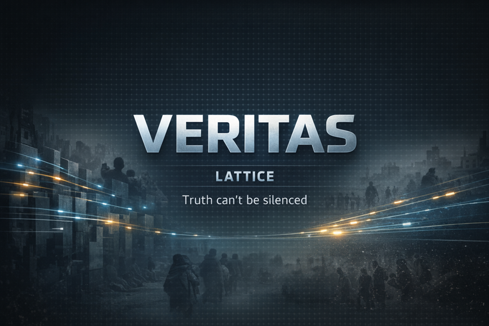

# Veritas - Prototype Workspace

**A decentralized, censorship-resistant video creation, publishing, and distribution platform - designed so truth can travel faster than it can be suppressed.**



Latest release: [Veritas Lattice 0.1.0](https://github.com/fahdabidi/Veritas/releases/latest)
Lattice baseline freeze: [veritas-lattice-0.1.0-baseline](https://github.com/fahdabidi/Veritas/releases/tag/veritas-lattice-0.1.0-baseline)

Architecture tracks:
- `Lattice`: V1 onion-mode baseline frozen at [Veritas Lattice 0.1.0](https://github.com/fahdabidi/Veritas/releases/tag/veritas-lattice-0.1.0-baseline)
- `Conduit`: V2 bridge-mode architecture in active development

Conduit references:
- System architecture: [docs/architecture/GBN-ARCH-000-System-Architecture-V2.md](docs/architecture/GBN-ARCH-000-System-Architecture-V2.md)
- MCN architecture: [docs/architecture/GBN-ARCH-001-Media-Creation-Network-V2.md](docs/architecture/GBN-ARCH-001-Media-Creation-Network-V2.md)
- Prototype redesign: [docs/prototyping/GBN-PROTO-005-Phase2-Distributed-Peer-to-Peer-Onion-Redesign.md](docs/prototyping/GBN-PROTO-005-Phase2-Distributed-Peer-to-Peer-Onion-Redesign.md)
- Execution plan: [docs/prototyping/GBN-PROTO-005-Phase2-Distributed-Peer-to-Peer-Onion-Redesign-Execution-Plan.md](docs/prototyping/GBN-PROTO-005-Phase2-Distributed-Peer-to-Peer-Onion-Redesign-Execution-Plan.md)

Support the project:
- Use the GitHub `Sponsor` button
- Funding policy: [docs/FUNDING.md](docs/FUNDING.md)
- Sponsor tiers and acknowledgments: [docs/FUNDING.md](docs/FUNDING.md#suggested-github-sponsors-tiers)

> *"The internet treats censorship as damage and routes around it."*
> - John Gilmore

---

## Project Status

This repository is an **active prototype** (`gbn-proto`) for validating core architecture and security assumptions.

- Lattice V1 is frozen as the protected baseline at [Veritas Lattice 0.1.0](https://github.com/fahdabidi/Veritas/releases/tag/veritas-lattice-0.1.0-baseline)
- Conduit V2 is being developed in a separate workspace and tracked in the linked V2 architecture and prototype docs above
- Core Rust workspace and crate boundaries are in place
- Integration test scaffolding exists for metadata stripping, multipath reassembly, tamper detection, end-to-end pipeline, DHT validation, gossip smoke, active heartbeat disconnect, and telescopic sinkhole resilience tests
- CLI orchestration commands are partially implemented (see `prototype/gbn-proto/crates/proto-cli/src/main.rs`)
- Not production-ready; APIs and protocols are expected to evolve during prototyping

If you are looking for full system design docs (requirements, architecture, security), see [docs/](docs/).

---

## Quick Start

### Prerequisites

- Rust 1.77+
- FFmpeg 6.0+
- (Optional for infra simulation) AWS CLI + Docker

### 1) Build the workspace

```bash
cd prototype/gbn-proto
cargo build --workspace
```

### 2) Run tests

```bash
cd prototype/gbn-proto
cargo test --workspace
```

### 3) Add local test videos (for media pipeline tests)

Place `.mp4` files in [prototype/gbn-proto/test-vectors/](prototype/gbn-proto/test-vectors/) (this directory is gitignored).

See [prototype/gbn-proto/test-vectors/README.md](prototype/gbn-proto/test-vectors/README.md) for expected files and guidance.

### 4) (Optional) AWS phase infrastructure

For EC2-based prototype runs and teardown, see [prototype/gbn-proto/infra/README-infra.md](prototype/gbn-proto/infra/README-infra.md).

### 5) Scan the repo for leaked secrets

Use the repo-local scanner before commits or sharing the workspace:

```bash
python tools/scan_secrets.py .
```

Fail CI or pre-push checks when findings exist:

```bash
python tools/scan_secrets.py . --fail-on-findings
```

The scanner looks for likely AWS credentials, private key blocks, GitHub tokens, JWTs,
and suspicious secret-style assignments. To suppress an intentional test fixture or
documented example on a specific line, add `secretscan:allow` to that line.

---

## Vision & Mission

Governments shut down the internet during elections. Footage of atrocities disappears from platforms within hours of being posted. Journalists are arrested because their metadata was subpoenaed. Protesters are identified from video they didn't know was being analyzed. Entire populations are cut off from the world at the moment the world most needs to see what is happening to them.

This is not a hypothetical threat model. It is the operating reality for creators, journalists, and witnesses in dozens of countries right now.

The tools that exist today were not built for this:

- **Mainstream platforms** comply with government takedown orders, log everything, and can identify uploaders on demand.
- **Tor + file sharing** protects routing anonymity but leaves creators responsible for their own operational security, key management, metadata stripping, and distribution — a burden that gets people killed.
- **VPNs** shift trust to a single commercial operator who can be compelled, acquired, or compromised.
- **Encrypted messengers** were designed for communication, not authenticated broadcast at scale.

The gap is not a better app. The gap is a **protocol** — one that treats suppression as a network fault and routes around it by design, not by policy.

**Veritas** (*Latin: truth*) is that protocol. It is a complete, end-to-end pipeline — from the moment a camera records something important, through anonymous multi-hop relay, to a Publisher who signs and distributes it globally — engineered so that no single government, platform, carrier, or attacker can simultaneously identify the creator, intercept the content, or suppress the distribution.

Truth is not fragile. It just needs infrastructure worthy of it.

### Design Principles

| Principle | What It Means In Practice |
|---|---|
| **Privacy by Default** | End-to-end encryption and local metadata sanitization before transmission |
| **Resilience over Efficiency** | Erasure-coded distribution across geographically diverse nodes |
| **Legal Responsibility at the Edges** | Editorial/legal responsibility is with Publishers and Content Providers |
| **Adaptive to Adversaries** | Pluggable transport strategy evolves against censorship techniques |
| **Sovereign Updates** | Supply-chain hardening via reproducible builds and multi-party governance (see [GBN-SEC-007](docs/security/GBN-SEC-007-Software-Supply-Chain.md)) |

<!-- SPONSOR_ACKS:START -->
## Sponsor Acknowledgments

Veritas is sustained by sponsors who help fund architecture work, testing, security preparation, and prototype infrastructure.

[](https://github.com/sponsors/fahdabidi)

Become our first sponsor.

If you'd like to support Veritas, use the GitHub `Sponsor` button or see [docs/FUNDING.md](docs/FUNDING.md).
<!-- SPONSOR_ACKS:END -->

---

## How It Works

**The Root of Trust:** The user journey strictly begins prior to recording the video. The Creator must first establish cryptographic trust by scanning the Publisher's Public Key via a QR code (or by downloading a pre-seeded Sovereign Publisher App). Additionally to seed the network the Publisher must provide (or the Creator must aquire) a few exit relays, located outside the geofence, that can connect to the Publisher to bypass Publisher geofencing. This ensures the MCN encrypts data specifically for that Publisher and structurally prevents adversary traffic interception.

### Journey of a Video

```
        CREATOR                 RELAY NETWORK (Lattice)                PUBLISHER
  (hostile jurisdiction)       (3-hop onion routing)               (trusted entity)

 +---------------------+                                       +---------------------+
 | 1. Record video     |       +========================+       | 5. Receive chunks   |
 | 2. Strip metadata   |       |  Path 1                |       |    (out-of-order)   |
 |    (GPS, device ID, |------>|  Guard > Middle > Exit |------>| 6. Decrypt each     |
 |     timestamps)     |       +========================+       | 7. Verify BLAKE3    |
 | 3. Chunk (1MB each) |       +========================+       | 8. Reassemble video |
 | 4. Encrypt chunks   |------>|  Path 2 (diff circuit) |------>| 9. Editorial review |
 |    (AES-256-GCM)    |       +=======================+        |10. Sign (Ed25519)   |
 |                     |       +========================+       |                     |
 |                     |------>|  Path 3 (diff circuit) |------>|                     |
 +---------------------+       +========================+       +----------+----------+
                                                                          |
                          GLOBAL DISTRIBUTED STORAGE                      |
                        +---------------------------------------------<---+
                        |
                        v
 +------------------------------------------------------------------------------+
 |  Reed-Solomon erasure coding: split into 20 shards (14 data + 6 parity).    |
 |  Distribute across volunteer nodes worldwide. ANY 14 of 20 shards can       |
 |  reconstruct the original. Content survives seizure of 6 nodes. Each shard  |
 | can have many replicas                                                      |
 +-------------------------------------+----------------------------------------+
                                        |
                          VIEWER        |
                        +----------------+
                        |
                        v
              +-------------------+
              | Discover content  |
              | via peer gossip   |
              |        |          |
              | Fetch 14 of 20    |
              | shards via BON    |
              |        |          |
              | Reconstruct and   |
              | play video        |
              +-------------------+
```


## Publisher Flow Packet Path implemented in Current Prototype

**Path/Return_Path**: Creator → Guard → Middle → Exit → Publisher

The path is created by the creator from its DHT which has been populated by the gossip network

**Onion build (Creator, routing layers nested innermost-first, payload sealed separately):**

```
payload     = seal(publisher_pub, { chunk_id, hash, chunk, return_path, send_timestamp_ms, total_chunks, chunk_index })
route_exit  = seal(exit_pub,   { next_hop: publisher_addr, inner: [] })
route_mid   = seal(middle_pub, { next_hop: exit_addr,      inner: route_exit })
route_grd   = seal(guard_pub,  { next_hop: middle_addr,    inner: route_mid })

// Wire frame sent to Guard over TCP:
[ u32_be len(route_grd) ][ route_grd ][ payload ]
```

`return_path` is a `Vec<HopInfo>` = `[creator, guard, middle, exit, publisher]`, each with `addr` and noise `identity_pub`. The creator entry carries the node's own address and pubkey so Publisher can seal the ACK's innermost layer for it.

**Each relay (Guard / Middle):**
1. Read compound frame `[u32_be routing_len][routing_sealed][payload_sealed]` from upstream TCP
2. `open(own_priv, routing_sealed)` → `{ next_hop, inner: next_routing }`
3. Connect to `next_hop`, write `[u32_be len(inner)][inner][payload_sealed]` as a length-prefixed frame
4. Read ACK frame from downstream; peel one ACK layer with own key; relay inner ACK back upstream

**Exit relay:**
- Same as above except `inner` is empty: forwards just `[payload_sealed]` (raw length-prefixed frame) to Publisher

**Publisher:**
1. `open(own_priv, payload_sealed)` → `{ chunk_id, hash, chunk, return_path, ... }`
2. Verify BLAKE3 hash, store chunk
3. Build reverse ACK onion from `return_path` (outermost = exit layer, innermost = creator layer)
4. Write ACK onion back to Exit on the same TCP stream

**ACK return path**: Publisher → Exit → Middle → Guard → Creator (each relay peels one ACK layer, relays inner to upstream)
ACK flows back on the same persistent TCP connections; no separate listener is needed at the Creator.

---

### Gossip Network Design

Every node in the GBN relay network participates in a **PlumTree epidemic broadcast** protocol (implemented over libp2p request/response) plus a **direct validation / anti-entropy control path**. Discovery, direct liveness, and routing trust are tracked separately.

**Current message roles:**

| Message Type | Transport | Purpose |
|---|---|---|
| NodeAnnounce | PlumTree broadcast | Periodic epidemic self-announcement for eventual convergence |
| DirectNodeAnnounce | Direct request/response | Immediate self-announcement to a newly connected peer |
| DirectNodePropagate | Direct request/response | Sampled anti-entropy batch of freshest known nodes |
| DirectNodeProbe | Direct request/response | Probe used to validate a propagated-only node directly |
| DirectNodeProbeResponse | Direct request/response | Direct self-response that upgrades a node from propagated-only to directly seen |

**How PlumTree works:**

PlumTree separates peers into two sets per node:

- **Eager peers** receive full message payloads immediately.
- **Lazy peers** receive only IHave message-ID announcements and pull with IWant if they missed the payload.

This keeps redundant traffic low under normal conditions while still repairing missed deliveries. Peers are promoted and demoted between eager and lazy sets with Graft and Prune.

**Deduplication:** Each message carries a 32-byte MessageId (content hash). Every node tracks a sliding window of seen IDs; duplicate deliveries are dropped immediately.

**Rate limiting:** Each node enforces a token-bucket bandwidth budget on outbound gossip to prevent a single announcement storm from saturating the network under high churn.

**Propagation diagram:**

~~~text
  A relay node announces itself through PlumTree:
  NodeAnnounce { addr, pub_key, role }

                        +--------------+
                        |  Originator  |
                        +------+-------+
            +------------------+------------------+
     eager push           eager push           IHave only
     (full payload)       (full payload)     (message-ID)
            |                  |                   :
            v                  v                   :
     +------------+    +--------------+    +--------------+
     |  Seed Node |    |   Guard A    |    |   Guard B    |
     +-----+------+    +------+-------+    +------+-------+
           |                  |                   | IWant (not yet seen)
    eager  |  lazy        eager|                  v
           v  : : :>           v           +-----------------+
     +---------+  IHave  +----------+      | full payload    |
     | Creator |         |  Middle  |      | pulled on-demand|
     +---------+         +----+-----+      +-----------------+
                              | eager
                              v
                        +----------+
                        |   Exit   |
                        +----------+

  --- full payload pushed immediately to eager peers
  : : IHave (message-ID only); receiver sends IWant to pull if not yet seen

  PlumTree spreads discovery widely, but direct validation still decides whether
  a discovered node is trusted for routing or for propagating more DHT entries.
~~~

**How the DHT is populated now (Lattice):**

1. A live node periodically broadcasts NodeAnnounce through PlumTree.
2. When two peers connect directly, they exchange DirectNodeAnnounce.
3. Every 10 seconds (configurable via `GBN_NODE_PROPAGATE_INTERVAL_SECS`), a node sends a sampled DirectNodePropagate batch from its local DHT to a random percentage of `direct` and `complete` neighbors only.
4. A node learned only through propagation is queued for DirectNodeProbe.
5. A successful direct probe response inserts the node as a direct sighting with `validation_state=unvalidated` and `validation_score=max(score,10)`.
6. Newly direct-but-unvalidated nodes are queued for an automatic bootstrap validation send: a random-length dummy chunk is sent to the Publisher using the new node as Guard plus default Middle and Exit nodes chosen from the highest-ranked eligible relays in the local DHT.
7. A valid Publisher ACK promotes that new Guard into `direct` through the normal scoring path.
8. `DirectNodePropagate` updates are accepted from nodes whose `validation_state` is `unvalidated`, `direct`, or `complete`.
9. Outbound propagation is target-aware:
   - `complete` peers receive a full ranked DHT slice
   - `direct` peers receive a minimal bootstrap DHT (default middle + default exit) to help them progress
   - `unvalidated` and `propagated_only` peers receive no `DirectNodePropagate`; they must bootstrap via the direct probe chain first

**How the Creator uses the gossip DHT (Lattice):**

~~~text
GOSSIP DESCRIPTOR (advertised in DHT / signed metadata)
+----------------------+-----------------------------------------------+
| Field                | Type / Meaning                               |
+----------------------+-----------------------------------------------+
| identity_key         | [u8; 32]                                     |
|                      | Node identity public key                     |
+----------------------+-----------------------------------------------+
| address              | SocketAddr                                   |
|                      | Globally reachable IP:port for onion ingress |
+----------------------+-----------------------------------------------+
| subnet_tag           | String                                       |
|                      | Role tag (HostileSubnet / FreeSubnet / etc.) |
+----------------------+-----------------------------------------------+
| announce_ts_ms       | u64                                          |
|                      | Self-advertised timestamp (ms)               |
+----------------------+-----------------------------------------------+
| signature            | [u8; 64]                                     |
|                      | Signature over identity/address/subnet/time  |
+----------------------+-----------------------------------------------+
~~~

~~~text
LOCAL SEED STORE ENTRY (runtime DHT table used by Creator/relays)
+-------------------------+----------------------------------------------+
| Field                   | Type / Meaning                              |
+-------------------------+----------------------------------------------+
| addr                    | SocketAddr                                   |
|                         | Node onion ingress endpoint                  |
+-------------------------+----------------------------------------------+
| identity_pub            | [u8; 32]                                     |
|                         | Node Noise pubkey used for onion encryption  |
+-------------------------+----------------------------------------------+
| subnet_tag              | String                                       |
|                         | Role tag from gossip                         |
+-------------------------+----------------------------------------------+
| announce_ts_ms          | u64                                          |
|                         | Newest self-announced timestamp from node    |
+-------------------------+----------------------------------------------+
| last_direct_seen_ms     | Option<u64>                                  |
|                         | Last time this node was heard directly       |
+-------------------------+----------------------------------------------+
| last_propagated_seen_ms | Option<u64>                                  |
|                         | Last time this node was heard through        |
|                         | propagation                                  |
+-------------------------+----------------------------------------------+
| last_observed_ms        | u64                                          |
|                         | Most recent local observation of any kind    |
+-------------------------+----------------------------------------------+
| validation_state        | enum                                         |
|                         | propagated_only / unvalidated / direct /     |
|                         | complete / isolated                          |
+-------------------------+----------------------------------------------+
| validation_score        | u32                                          |
|                         | Routing confidence score                     |
+-------------------------+----------------------------------------------+
| last_seen_ms            | u64                                          |
|                         | Legacy compatibility field                   |
+-------------------------+----------------------------------------------+
~~~

~~~text
VALIDATION STATE MACHINE (Lattice)

propagated_only
  Learned indirectly through DHT propagation.
  Not trusted for routing.

unvalidated
  First direct sighting seeds validation_score to 10.
  Eligible as a last-resort routing fallback during bootstrap.
  Newly direct/unvalidated nodes are also queued for an automatic dummy-packet
  validation send to force early promotion into direct.

direct
  At least one chunk path using this node produced a valid publisher ACK.
  The node is usable for routing and may propagate bootstrap DHT snapshots.

complete
  validation_score > 20.
  Fully trusted for routing and for full accepted DHT propagation.

isolated
  validation_score == 0.
  Entry stays in the DHT until stale cleanup, but is excluded from routing.
~~~

~~~text
VALIDATION SCORE RULES
+-------------------------------+--------------------------------------------+
| Event                         | Effect                                     |
+-------------------------------+--------------------------------------------+
| First direct sighting         | score := max(score, 10)                    |
| First direct sighting         | state := unvalidated                       |
| Successful ACKed chunk        | score += 1                                 |
| First ACK while unvalidated   | state := direct                            |
| Score exceeds 20              | state := complete                          |
| Failed routed chunk           | score -= 1                                 |
| Score reaches 0               | state := isolated                          |
+-------------------------------+--------------------------------------------+
~~~

~~~text
DumpDht Control Output (creator control plane response)
+---------------------+-------------------------------------------------------+
| Field               | Type / Meaning                                        |
+---------------------+-------------------------------------------------------+
| store               | Vec<RelayNode>                                        |
|                     | Full local seed-store table                           |
+---------------------+-------------------------------------------------------+
| kademlia_buckets    | Vec<String>                                           |
|                     | Hash bucket peer preimages from libp2p Kademlia view  |
+---------------------+-------------------------------------------------------+
~~~

When a Creator wants to send, it queries its local in-memory DHT and filters candidates by validation state:

- **Guard** - prefer `complete`, then `direct`, then `unvalidated`
- **Middle** - same tier ordering, Guard excluded
- **Exit** - same tier ordering, but must be a `FreeSubnet` relay
- **Publisher** - the known Publisher address

**Bootstrap validation of new nodes:**

- propagated_only nodes are queued for direct probe and are not used for routing.
- unvalidated nodes are eligible only after a direct sighting and remain lower priority than `direct` and `complete`.
- when a new direct/unvalidated node appears, the system automatically sends a random-length dummy packet to the Publisher with:
  guard = the node under validation
  middle = highest-ranked eligible middle relay in the local DHT
  exit = highest-ranked eligible `FreeSubnet` relay in the local DHT
- if the Publisher ACK returns successfully, the guard, middle, and exit all gain a validation score point; the guard promotes into `direct`.
- once the node's score exceeds 20, it becomes `complete`.

The Creator still builds the onion circuit from local DHT state, but it now excludes only `isolated` and `propagated_only` nodes, then prefers stronger validation evidence in this order: `complete > direct > unvalidated`.

---

### What each participant can observe (Lattice)

```text
Creator      -> Sees: local video + target Publisher key
               Sees full relay topology and Pub Keys

Guard relay  -> Sees: previous hop + next hop
               Cannot see: payload plaintext or final destination context

Middle relay -> Sees: adjacent hops only
               Cannot see: creator identity, publisher identity, or content plaintext

Exit relay   -> Sees: prior hop and destination endpoint
               Cannot see: origin creator identity or content plaintext

Publisher    -> Sees: decrypted submitted content
               Can see: full relay topology and Pub Keys back to creator for Ack message

Storage node -> Sees: encrypted shards by content-addressed ID
               Cannot see: plaintext media

Viewer       -> Sees: playable stream/content
               Cannot see: creator identity or full relay path
```

### Prototype components in this workspace

| Component | Purpose (prototype scope) | Primary use in this prototype |
|---|---|---|
| `gbn-protocol` | Shared wire types and serialization contracts for chunks, manifests, onion routing, DHT, and crypto payloads | Common dependency used across every service role |
| `mcn-sanitizer` | Media sanitization pipeline and FFmpeg-based metadata stripping | Creator-side preprocessing before chunking/upload |
| `mcn-chunker` | Chunking, hashing, and manifest-oriented segmentation helpers | Creator-side chunk generation and integrity bookkeeping |
| `mcn-crypto` | Publisher key generation, upload-session encryption, and Noise-based onion seal/open helpers | Creator and publisher cryptographic flow |
| `mcn-router-sim` | Gossip/DHT, relay control plane, telescopic onion routing, ACK relay path, and distributed trace metadata | Relay, creator, seed relay, and transport orchestration |
| `mpub-receiver` | Publisher-side onion terminal receive path, chunk acceptance, transport ACK generation, and session completion tracking | Publisher role runtime |
| `proto-cli` | The `gbn-proto` binary entrypoint that wires all crates together into runnable commands and service modes | Single executable used by the prototype containers and local CLI |

### Phase Prototype Image Mapping

Both prototype Dockerfiles currently compile the same binary:

```bash
cargo build --release --bin gbn-proto --features distributed-trace
```

The `dht-validation-policy` feature (gossip tiering, bootstrap validation, DHT state machine) is also active in deployed images — it is listed in the `default` features of `mcn-router-sim` and enabled automatically when the workspace is built. Both images link the full workspace transitively through `proto-cli`.

| Component | `gbn-relay` image | `gbn-publisher` image | Notes |
|---|---|---|---|
| `gbn-protocol` | Yes | Yes | Shared dependency of the single `gbn-proto` binary |
| `mcn-sanitizer` | Yes | Yes | Linked through `proto-cli`, even if not exercised by every runtime role |
| `mcn-chunker` | Yes | Yes | Linked through `proto-cli` |
| `mcn-crypto` | Yes | Yes | Linked through `proto-cli` |
| `mcn-router-sim` | Yes | Yes | Linked through `proto-cli` |
| `mpub-receiver` | Yes | Yes | Linked through `proto-cli` |
| `proto-cli` | Yes | Yes | Defines the `gbn-proto` binary built into both images |

### Current Phase Stack Runtime Usage

| Runtime role in `phase1-scale-stack.yaml` | Image currently used | Notes |
|---|---|---|
| `SeedRelayInstance` | `gbn-relay` | Static EC2 bootstrap relay; kept as the single seed relay for network bring-up |
| `HostileRelayService` | `gbn-relay` | ECS/Fargate relay tasks in hostile subnet |
| `FreeRelayService` | `gbn-relay` | ECS/Fargate relay tasks in free subnet |
| `CreatorService` | `gbn-relay` | ECS/Fargate creator role also runs the same `gbn-proto` binary image |
| `PublisherInstance` | `gbn-relay` | Current stack still launches publisher mode from the relay image |
| `gbn-publisher` ECR image | Built and published, but not wired into the current phase stack | `Dockerfile.publisher` exists, but `phase1-scale-stack.yaml` does not currently launch the publisher instance from `ContainerImagePublisher` |

---

## Repository Layout

```text
gbn-proto/
|-- Cargo.toml
|-- README.md
|-- crates/
|   |-- gbn-protocol/
|   |-- mcn-sanitizer/
|   |-- mcn-chunker/
|   |-- mcn-crypto/
|   |-- mcn-router-sim/
|   |-- mpub-receiver/
|   `-- proto-cli/
|-- infra/
|   |-- README-infra.md
|   |-- cloudformation/
|   `-- scripts/
|-- test-vectors/
|   `-- README.md
`-- tests/
    `-- integration/
        |-- test_metadata_stripping.rs
        |-- test_multipath_reassembly.rs
        |-- test_tamper_detection.rs
        `-- test_full_pipeline.rs
```

---

## Technical Stack (Prototype)

| Layer | Technology | Why |
|---|---|---|
| Core implementation | Rust | Memory safety + performance for protocol/security-critical paths |
| Crypto primitives | `x25519-dalek`, `aes-gcm`, `ed25519-dalek`, `blake3`, `hkdf` | Modern, auditable Rust crypto ecosystem |
| Async runtime | Tokio | Mature async I/O runtime |
| Erasure coding target (planned) | `reed-solomon-erasure` | k-of-n reconstruction model |
| Metadata stripping | FFmpeg (CLI integration) | Broad container support |
| Mobile target (planned) | Kotlin + Rust FFI | Native Android UX with shared Rust core |

> Note: Some architectural docs discuss future VCP service implementations in Go. Those are design-stage targets, not part of this prototype workspace.

---

## Prototyping Phases

### Phase 1 - Media Creation Network & zero-trust routing
Plan: [docs/prototyping/GBN-PROTO-001-Phase1-Media-Creation.md](docs/prototyping/GBN-PROTO-001-Phase1-Media-Creation.md)

### Phase 2 - Publishing & distributed storage
Plan: [docs/prototyping/GBN-PROTO-002-Phase2-Publishing-Storage.md](docs/prototyping/GBN-PROTO-002-Phase2-Publishing-Storage.md)

### Phase 3 - Overlay broadcast network & playback
Plan: [docs/prototyping/GBN-PROTO-003-Phase3-Broadcast-Playback.md](docs/prototyping/GBN-PROTO-003-Phase3-Broadcast-Playback.md)

---

## Security Model (Summary)

GBN uses a **Zero-Knowledge Transit** design goal: intermediate nodes should know only what is necessary for forwarding.

Detailed security docs:
- [GBN-SEC-001 — Media Creation Network](docs/security/GBN-SEC-001-Media-Creation-Network.md)
- [GBN-SEC-002 — Media Publishing](docs/security/GBN-SEC-002-Media-Publishing.md)
- [GBN-SEC-003 — Global Distributed Storage](docs/security/GBN-SEC-003-Global-Distributed-Storage.md)
- [GBN-SEC-004 — Video Content Providers](docs/security/GBN-SEC-004-Video-Content-Providers.md)
- [GBN-SEC-005 — Video Playback App](docs/security/GBN-SEC-005-Video-Playback-App.md)
- [GBN-SEC-006 — Broadcast Network](docs/security/GBN-SEC-006-Broadcast-Network.md)
- [GBN-SEC-007 — Software Supply Chain](docs/security/GBN-SEC-007-Software-Supply-Chain.md)

### Dynamic Circuit Rebuilding & Anonymity

Because the GBN relies on consumer devices scaling dynamically to provide routing services, node churn is inevitable. The architecture implements **Active Heartbeat Disconnects** over the inner `Noise_XX` layer, enabling near-instantaneous detection of relay failure. Upon failure, dropping circuits immediately release un-ACKed chunks into a reassignment queue, dialing fresh circuits. To resist **Temporal Circuit Correlation** (adversaries mapping sequential circuit rebuilds to origin metadata), replacement circuits explicitly select completely separate Guard hubs — rendering temporal drops disjoint and preserving anonymity.

### Important limitations

As documented in the security files, the system **does not fully mitigate**:
- endpoint compromise (malware/physical seizure)
- global passive adversary traffic correlation (partially mitigated)
- complete internet shutdown/physical disconnection events

---

## Documentation Index

All system-level docs live under [docs/](docs/):

- Requirements: `docs/requirements/GBN-REQ-*.md`
- Architecture: `docs/architecture/GBN-ARCH-*.md`
- Security: `docs/security/GBN-SEC-*.md`
- Prototyping: `docs/prototyping/GBN-PROTO-*.md`
- Research: `docs/research/GBN-RESEARCH-*.md`

---

## AWS Test Setup and Prototype Scripts

The main AWS bring-up flow for the current phase prototype is:

1. Build the Rust binary and publish container images to ECR.
2. Deploy the CloudFormation stack and start the seed topology.
3. Expand to smoke or scale topology.
4. Use the relay control panel to inspect DHT state and run end-to-end path tests.

All of these scripts use the **AWS CLI** for their AWS operations. Before using them from WSL Ubuntu, make sure:

1. `aws` is installed and available in the WSL Ubuntu shell `PATH`
2. you have completed AWS authentication successfully in that same environment
3. the CLI can make authenticated calls for the target account and region

Minimum prerequisite check from WSL Ubuntu:

```bash
aws configure list
aws sts get-caller-identity
```

If those commands do not work, do not proceed with the deploy scripts yet. Fix AWS CLI installation and complete your AWS sign-in / credential setup first.

### AWS Test Infrastructure Setup

Running `deploy-scale-test.sh` lays down a single VPC partitioned into two subnets (`HostileSubnet` in AZ-0, `FreeSubnet` in AZ-1) and launches the prototype roles across Fargate and static EC2. Creator and hostile relay tasks run in the hostile subnet; free relay tasks and the Publisher EC2 live in the free subnet, simulating a geofence. The Publisher security group accepts onion ingress **only** from the free subnet, so the exit hop must be a `FreeSubnet` relay — this is what the creator's path selector enforces at the application layer.

```
  OPERATOR (WSL Ubuntu)                                             AWS ACCOUNT / REGION
  +---------------------+                                     +--------------------------------+
  | build-and-push.sh   |-- docker push gbn-relay:latest ---->|  ECR: gbn-relay, gbn-publisher |
  | deploy-scale-test.sh|-- cfn deploy + aws ecs update ----->|  CloudFormation: phase1 stack  |
  +---------------------+                                     +---------------+----------------+
                                                                              |
                                                                              v
 +---------------------------------------- VPC (10.x/16) ----------------------------------------+
 |                                                                                               |
 |  +------------------ HostileSubnet (AZ-0) ------------------+  +----- FreeSubnet (AZ-1) -----+|
 |  |                                                          |  |                             ||
 |  |  +-----------------+   +------------------------------+  |  |  +----------------------+   ||
 |  |  | SeedRelayInst.  |   | ECS Fargate                  |  |  |  | ECS Fargate          |   ||
 |  |  | (static EC2     |   |   HostileRelayService        |  |  |  |   FreeRelayService   |   ||
 |  |  |  host-net,      |   |   desired = 90% of scale     |  |  |  |   desired = 10% of   |   ||
 |  |  |  docker pull    |   |                              |  |  |  |   scale              |   ||
 |  |  |  :latest)       |   | ECS Fargate                  |  |  |  |                      |   ||
 |  |  |  SG: RelaySG    |   |   CreatorService             |  |  |  |  SG: RelaySG         |   ||
 |  |  +--------+--------+   |   desired = 1                |  |  |  +----------+-----------+   ||
 |  |           |            |   SG: RelaySG                |  |  |             |               ||
 |  |           |            +--------------+---------------+  |  |             |               ||
 |  |           |                           |                  |  |             |               ||
 |  |           +---------- east-west onion traffic -----------+--+-------------+               ||
 |  |                       (RelaySG allows intra-VPC 9001/tcp)  |                               ||
 |  |                                                            |  +----------------------+   ||
 |  |                                                            |  | PublisherInstance    |   ||
 |  |                                                            |  | (static EC2          |   ||
 |  |                                                            |  |  host-net)           |   ||
 |  |                                                            |  | SG: PublisherSG      |   ||
 |  |                                                            |  | INGRESS only from    |   ||
 |  |                                                            |  | FreeSubnet CIDR      |   ||
 |  |                                                            |  +----------------------+   ||
 |  +------------------------------------------------------------+  +-----------------------+   ||
 |                                                                                              ||
 |  IGW + public route table; AssignPublicIp=ENABLED on all Fargate tasks                       ||
 +----------------------------------------------------------------------------------------------+|
                                                                                                 |
  +---------------------------+           +-----------------------------+                        |
  | ChaosControllerLambda     |<--cron----| EventBridge: ChaosEngineRule|                        |
  | (stops % of hostile/free  |           | (enabled only if ENABLE_    |                        |
  |  tasks per tick)          |           |  CHAOS=1 at deploy time)    |                        |
  +-----------+---------------+           +-----------------------------+                        |
              |                                                                                  |
              v                                                                                  |
  +-----------------------------+        +----------------------------------+                    |
  | CloudWatch: GBN/ScaleTest   |<-------| all task/EC2 roles emit metrics  |                    |
  | (BootstrapResult, GossipBW, |        | dimensions: Scale, Subnet, NodeId|                    |
  |  ChunksDelivered, ...)      |        +----------------------------------+                    |
  +-----------------------------+                                                                 |
                                                                                                  |
  Operator access paths:                                                                          |
    - ECS tasks  -> `aws ecs execute-command` (via `relay-control-interactive.sh`)                |
    - Static EC2 -> AWS SSM Session Manager                                                       |
```

Deploy ordering (as enforced by `deploy-scale-test.sh`):

1. Generate Publisher keypair + ephemeral SeedRelay Noise key (step 1/6).
2. `aws cloudformation deploy` — creates VPC, subnets, SGs, IAM roles, ECR repos, both static EC2 instances, ECS cluster + task defs + services (services start at desired=0), Chaos Lambda + EventBridge rule (rule disabled by default) (step 2/6).
3. Auto-run `build-and-push.sh` if the relay ECR repo is empty; otherwise static EC2 user-data would loop on `docker pull` (step 2.5/6).
4. `restart-static-nodes.sh` — reboots SeedRelay + Publisher so they pull the freshly-pushed `:latest` image with host networking (step 3/7).
5. Wait for `docker ps` on SeedRelay to report `gbn-seed-relay` before any ECS service is scaled (step 3.5/7) — this prevents the thundering-herd bootstrap failure observed in prior runs.
6. Scale `HostileRelayService` / `FreeRelayService` / `CreatorService` to the seed topology (`SEED_PERCENT`, default 30%) (step 5/7).
7. Stabilization Gate 1: wait until ≥90% of the seed tasks are `RUNNING` in ECS; `BootstrapResult` CloudWatch metric is queried every 30s as a diagnostic only, not a gate (step 6/7).
8. Scale services to the full target split — 90% hostile / 10% free — unless `SMOKE_TOPOLOGY=1` (step 7/7).
9. Configure and optionally enable the Chaos EventBridge rule after `CHAOS_ENABLE_DELAY_SECONDS` (step 8/8).

### Important scripts

| Script | What it does | Main infrastructure touched |
|---|---|---|
| [`build-and-push.sh`](/C:/Users/fahd_/OneDrive/Documents/Global%20Broadcast%20Network/prototype/gbn-proto/infra/scripts/build-and-push.sh) | Compiles `gbn-proto`, builds `gbn-relay` and `gbn-publisher` Docker images, tags them with `latest` and git SHA, and pushes both to ECR | Existing ECR repositories exposed by the CloudFormation stack |
| [`deploy-smoke-n5.sh`](/C:/Users/fahd_/OneDrive/Documents/Global%20Broadcast%20Network/prototype/gbn-proto/infra/scripts/deploy-smoke-n5.sh) | Thin wrapper around `deploy-scale-test.sh` that forces a 5-node smoke topology | Same phase stack, but runtime topology pinned to 2 hostile relays + 1 free relay + 1 creator + 1 static seed |
| [`deploy-scale-test.sh`](/C:/Users/fahd_/OneDrive/Documents/Global%20Broadcast%20Network/prototype/gbn-proto/infra/scripts/deploy-scale-test.sh) | Deploys the Phase 1 scale stack, generates publisher/seed keys, optionally auto-builds images if ECR is empty, restarts static nodes, scales ECS services, and optionally enables chaos churn | CloudFormation stack, ECS cluster/services, ECR repos, static EC2 seed/publisher nodes, chaos Lambda and EventBridge rule |
| [`relay-control-interactive.sh`](/C:/Users/fahd_/OneDrive/Documents/Global%20Broadcast%20Network/prototype/gbn-proto/infra/scripts/relay-control-interactive.sh) | Discovers live ECS and EC2 nodes and lets you run control-plane commands against them | ECS Exec against creator/relay tasks and SSM against seed/publisher EC2 nodes |
| [`teardown-scale-test-safe.sh`](/C:/Users/fahd_/OneDrive/Documents/Global%20Broadcast%20Network/prototype/gbn-proto/infra/scripts/teardown-scale-test-safe.sh) | Safely tears down ECS services to zero, optionally deletes the CloudFormation stack, and scales down static nodes | ECS services, CloudFormation stack, static EC2 instances |
| [`restart-static-nodes.sh`](/C:/Users/fahd_/OneDrive/Documents/Global%20Broadcast%20Network/prototype/gbn-proto/infra/scripts/restart-static-nodes.sh) | Restarts the SeedRelay and Publisher EC2 instances so they pull the current ECR image | Static EC2 seed relay and publisher instances |

### What the deploy scripts create

The deploy flow targets the Phase 1 CloudFormation template and brings up the current prototype stack:

- ECR repositories for `gbn-relay` and `gbn-publisher`
- ECS cluster for the dynamic relay and creator tasks
- ECS services for:
  - hostile relays
  - free relays
  - creator
- Static EC2 instances for:
  - seed relay
  - publisher
- CloudWatch metrics and the scale/chaos control plane used by the test harness
- Chaos controller Lambda and scheduled EventBridge rule when chaos support is enabled in the stack

### 1. Build and push images

Run from WSL Ubuntu or another shell that has `cargo`, `docker`, and `aws` configured:

```bash
cd prototype/gbn-proto/infra/scripts
bash build-and-push.sh gbn-proto-phase1-scale-n100 us-east-1
```

What this does:

- resolves the stack outputs to find the relay and publisher ECR repositories
- compiles the release `gbn-proto` binary with `distributed-trace`
- builds both Docker images
- pushes both `latest` and git-SHA tags to ECR

If the stack does not yet expose ECR outputs, the script derives the ECR repository URIs from the AWS account ID and region.

### 2. Deploy a smoke topology

Use the smoke wrapper when you want a fast sanity check with a small network:

```bash
cd prototype/gbn-proto/infra/scripts
bash deploy-smoke-n5.sh gbn-proto-phase1-scale-n100 us-east-1
```

This enforces:

- `SMOKE_TOPOLOGY=1`
- 2 hostile ECS relays
- 1 free ECS relay
- 1 ECS creator
- 1 static EC2 seed relay
- 1 static EC2 publisher

The wrapper delegates to `deploy-scale-test.sh` but prevents accidental full-scale expansion.

### 3. Deploy the scale topology

For scale runs, use the scale deploy script directly:

```bash
cd prototype/gbn-proto/infra/scripts
bash deploy-scale-test.sh gbn-proto-phase1-scale-n100 100 us-east-1
```

Key behaviors:

- generates publisher keys if they do not already exist under `prototype/gbn-proto/`
- deploys the CloudFormation stack
- ensures relay images exist in ECR, and can auto-run `build-and-push.sh` if ECR is empty
- restarts the static EC2 seed and publisher nodes so they pull current images and come up with the expected networking mode
- scales ECS services into a seeded topology first
- waits for the seed relay container and initial ECS running-count gate
- expands from seed topology to full target unless `SMOKE_TOPOLOGY=1`

Default scale assumptions:

- `ScaleTarget=100` unless overridden
- `SEED_PERCENT=30`
- `RESTART_STATIC_NODES=1`
- `AUTO_BUILD_PUSH_IF_ECR_EMPTY=1`

### 4. Enable chaos during scale runs

`deploy-scale-test.sh` supports scheduled churn for hostile and free relays.

Example:

```bash
cd prototype/gbn-proto/infra/scripts
ENABLE_CHAOS=1 \
CHAOS_ENABLE_DELAY_SECONDS=180 \
CHAOS_HOSTILE_CHURN_RATE=0.4 \
CHAOS_FREE_CHURN_RATE=0.2 \
bash deploy-scale-test.sh gbn-proto-phase1-scale-n100 100 us-east-1
```

Important chaos knobs:

- `ENABLE_CHAOS=1`
  Enables the EventBridge rule after deploy
- `CHAOS_ENABLE_DELAY_SECONDS`
  Wait time before the rule is enabled
- `CHAOS_HOSTILE_CHURN_RATE`
  Fraction of hostile relay tasks churned by the chaos controller
- `CHAOS_FREE_CHURN_RATE`
  Fraction of free relay tasks churned by the chaos controller

### 5. Operate the deployed network with relay-control-interactive

After deployment, use the control panel to inspect the live topology and run tests:

```bash
cd prototype/gbn-proto/infra/scripts
bash relay-control-interactive.sh \
  gbn-proto-phase1-scale-n100-cluster \
  us-east-1 \
  gbn-proto-phase1-scale-n100
```

What it does:

- discovers live ECS tasks for:
  - `CreatorService`
  - `HostileRelayService`
  - `FreeRelayService`
- discovers the static EC2:
  - `SeedRelayInstance`
  - `PublisherInstance`
- connects through:
  - ECS Exec for ECS tasks
  - SSM for EC2 nodes

Important interactive commands:

| Command | Purpose |
|---|---|
| `DumpDht` | View each node's local DHT / seed-store contents |
| `DumpMetadata` | Dump packet metadata / trace ring buffer entries |
| `BroadcastSeed` | Force a seed-style gossip propagation event |
| `UnicastDHT` | Trigger direct DHT exchange toward a chosen target |
| `SendDummy` | Build a creator -> guard -> middle -> exit -> publisher path and send a dummy payload |
| `LiveMetrics` | Stream live CloudWatch metrics for the active topology |
| `Refresh nodes` | Re-scan the current live ECS/EC2 inventory |
| `checkimages` | Verify image/runtime consistency on deployed nodes |

### Typical AWS prototype workflow

```bash
cd prototype/gbn-proto/infra/scripts

# build and publish images
bash build-and-push.sh gbn-proto-phase1-scale-n100 us-east-1

# deploy smoke or scale
bash deploy-smoke-n5.sh gbn-proto-phase1-scale-n100 us-east-1
# or
bash deploy-scale-test.sh gbn-proto-phase1-scale-n100 100 us-east-1

# inspect and test the live network
bash relay-control-interactive.sh \
  gbn-proto-phase1-scale-n100-cluster \
  us-east-1 \
  gbn-proto-phase1-scale-n100
```

To tear down after a run:

```bash
bash teardown-scale-test-safe.sh gbn-proto-phase1-scale-n100 us-east-1
```

---

### 6. Security Gaps, Lessons Learned, and Conduit (V2) Plan

### Security Gaps & Lessons Learned

The **Lattice** (V1) prototype is functionally validated at N=5 but surfaces several structural gaps at N=100 that shape the Conduit (V2) roadmap. See [GBN-ARCH-000 §9](docs/architecture/GBN-ARCH-000-System-Architecture.md) and [GBN-ARCH-001 §7](docs/architecture/GBN-ARCH-001-Media-Creation-Network.md) for the specced threat model; the items below are observed gaps against that design.

- **Bringup brownout risk.** The Lattice network is vulnerable to brownout during cold-start. Nodes self-regulate (rate-limited probes, tiered gossip, score-based promotion) to damp the load, but the same knobs can be inverted by attackers injecting many "fake" low-score nodes to starve the validation queue. In our Lattice prototype we used a single Seed Relay to boot the network; that relay gets overwhelmed quickly when bringing up even 70 ECS nodes.
- **Mobile reachability mismatch.** Lattice requires every relay to accept unsolicited inbound connections so peers can complete the `DirectNodeProbe → ProbeResponse` handshake. Real mobile carriers (CGNAT, default-deny inbound) break this assumption — the architecture silently degrades to "creator-only" participation for the majority of would-be phone nodes. This is the single largest deployment blocker and directly motivates the Conduit Bridge Mode.
- **Trust-but-verify slows but doesn't prevent Sybil sinkholes.** Telescopic validation ([GBN-ARCH-001 §3.4](docs/architecture/GBN-ARCH-001-Media-Creation-Network.md)) and the `PropagatedOnly → Unvalidated → Direct → Complete` score ladder delay a malicious node from reaching routable state, but the DHT itself remains a topology oracle: a single compromised node learns its neighbors and can map regions of the overlay.
- **Open-source fork attack surface.** Because the client is open source, adversaries can distribute modified binaries that (a) harvest neighbor identities to deanonymize users, (b) coordinate a triggered brownout / mass-sinkhole, or (c) cooperate with complicit carriers to shift IP ranges in lockstep and invalidate cached catalogs. Each of these requires cross-carrier coordination at geofence scale, so they are plausible attacks from state actors but unlikely from smaller adversaries.
- **Attestation is available but not deployable.** Android AVF + DICE and iOS App Attest would bind node identity to a sealed binary and defeat the fork-distribution class of attack. Standard app-store distribution is incompatible with the app's policy profile, so attestation currently depends on sideload / enterprise distribution channels not yet implemented.
- **Critical-mass bootstrapping problem.** Confident creator-identity protection needs ~10K+ concurrent and ~millions of total nodes per geofence. Below that threshold, traffic-correlation and timing attacks succeed cheaply, and a state actor can sinkhole the network before it achieves anonymity-set scale.
- **Spec-vs-implementation drift.** Several mitigations from [GBN-ARCH-001 §7.2](docs/architecture/GBN-ARCH-001-Media-Creation-Network.md) remain design-only in the prototype: no cover traffic generator, no multi-circuit chunk dispersion per upload, no pluggable transports (obfs4 / WebTunnel), no visual anonymization (OpenCV / YOLO face+plate blur), no temporal jitter on circuit rebuilds. These are tracked as V2+ work and noted here to avoid confusion when reading the architecture docs.

### Conduit Architecture (V2) — Next Milestone

**Conduit** is **additive, not a replacement** — Lattice (V1) Onion Mode is preserved for anonymity-critical flows while Conduit (V2) Bridge Mode targets mobile viability. Full specs: [GBN-ARCH-000-V2 (Conduit)](docs/architecture/GBN-ARCH-000-System-Architecture-V2.md), [GBN-ARCH-001-V2 (Conduit)](docs/architecture/GBN-ARCH-001-Media-Creation-Network-V2.md), execution plan in [GBN-PROTO-005](docs/prototyping/GBN-PROTO-005-Phase2-Distributed-Peer-to-Peer-Onion-Redesign.md).

- **Single-hop bridge topology.** `Creator → ExitBridge → Publisher` replaces Lattice's `Guard → Middle → Exit` path for creator uploads, eliminating three-party path construction over unreliable mobile links ([§5 Network Topology](docs/architecture/GBN-ARCH-000-System-Architecture-V2.md#5-network-topology)).
- **Publisher-Authorized Transport.** The Publisher becomes the authority that signs `BridgeDescriptor` leases and issues signed bridge catalogs; a node is transport-eligible only if it holds an unexpired Publisher signature ([§6 Identity and Authority](docs/architecture/GBN-ARCH-000-System-Architecture-V2.md#6-identity-and-authority-architecture)). This directly mitigates the Sybil / fork-distribution classes above — a malicious binary cannot self-promote into the exit set.
- **Weak Discovery, Strong Authority.** DHT/gossip continues to *suggest* bridge candidates but no longer *authorizes* them; authority decisions move to signed catalogs. Compromised discovery nodes can waste dial budget but cannot insert themselves as exits ([§1.2 Core Principles](docs/architecture/GBN-ARCH-000-System-Architecture-V2.md#12-core-architectural-principles)).
- **Reachability as first-class.** `BridgeDescriptor.reachability_class` (`direct` / `brokered` / `relay_only`) replaces the Lattice assumption that every overlay node is inbound-dialable, closing the mobile-NAT gap called out above ([§4 Bridge Descriptor Model](docs/architecture/GBN-ARCH-001-Media-Creation-Network-V2.md#4-bridge-descriptor-model)).
- **Creator only needs one reachable bridge.** Catalog-driven failover replaces path reconstruction: if a bridge fails the creator marks it suspect, selects the next cached signed descriptor, and resumes — no multi-hop rebuild, no DHT walk on the hot path ([§7 Failure And Recovery](docs/architecture/GBN-ARCH-001-Media-Creation-Network-V2.md#7-failure-and-recovery-model)).
- **Lease-bound bridge lifetime.** Leases carry `lease_expiry_ms` with heartbeat renewal and explicit `BridgeRevoke`, giving the Publisher a fast kill switch for compromised bridges — a capability Lattice lacks ([§5.1 Registration Messages](docs/architecture/GBN-ARCH-001-Media-Creation-Network-V2.md#51-registration-and-authority-messages)).
- **Payload confidentiality preserved.** ExitBridges forward opaque creator-sealed payloads and cannot decrypt content; the trust reduction vs Lattice is in *path anonymity* (single-hop sees the creator endpoint), not payload secrecy ([§8.1 Security Properties Preserved](docs/architecture/GBN-ARCH-000-System-Architecture-V2.md#81-security-properties-preserved)).
- **Explicit anonymity trade-off.** Timing correlation and first-hop adjacency leak more than Lattice's 3-hop onion; Conduit is a **mobile viability architecture**, not a full anonymity replacement ([§8 Security Architecture](docs/architecture/GBN-ARCH-000-System-Architecture-V2.md#8-security-architecture)).
- **Workspace and infra isolation.** Conduit ships in a separate crate tree (`prototype/gbn-bridge-proto/`) with independent image names, CloudFormation stacks, and metric namespace so it cannot destabilize the validated Lattice deployment ([§7 Deployment Model](docs/architecture/GBN-ARCH-000-System-Architecture-V2.md#7-deployment-model)).
- **Phased validation gate.** Conduit must clear M3/M4 (catalog bootstrap, bridge failover, signed-descriptor enforcement, payload opacity) before any decision to promote Bridge Mode to the default creator transport ([§10 Migration Guidance](docs/architecture/GBN-ARCH-001-Media-Creation-Network-V2.md#10-migration-guidance)).

## Contributing (Prototype)

Contributions are welcome for prototype hardening, test coverage, and correctness improvements.

Suggested contribution flow:
1. Open an issue describing the problem or enhancement
2. Propose scope aligned to the active prototype phase
3. Submit a PR with tests (`cargo test --workspace`)
4. Include doc updates when behavior/protocol assumptions change

---

## License

This prototype workspace is currently licensed under **Apache-2.0** (see workspace `Cargo.toml`).
