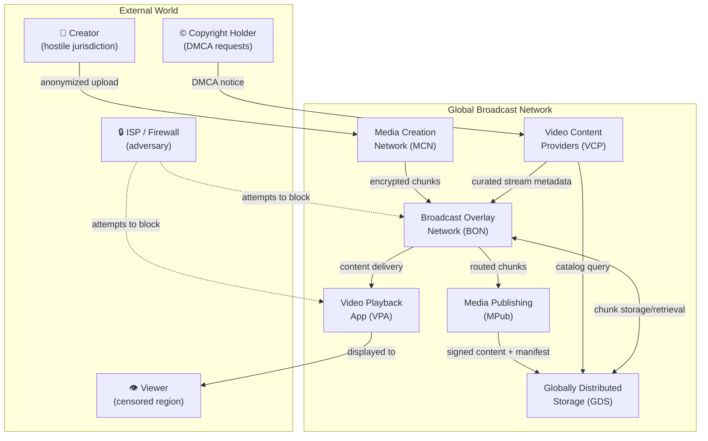
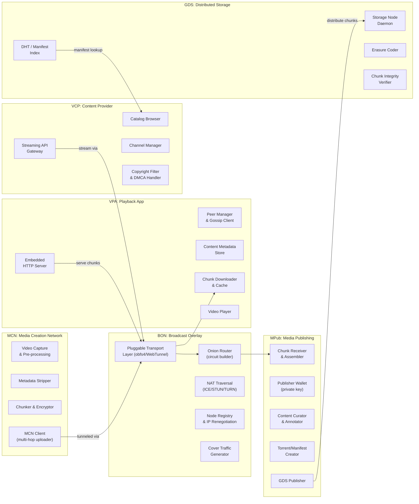
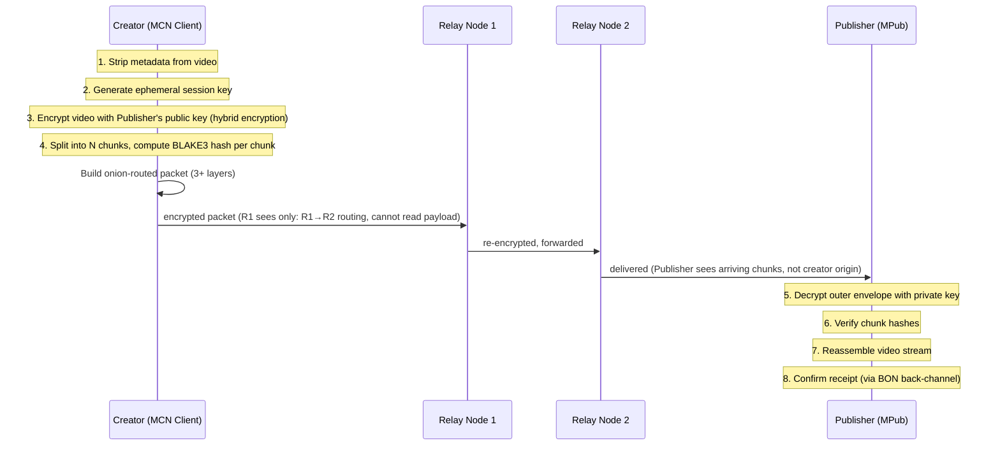
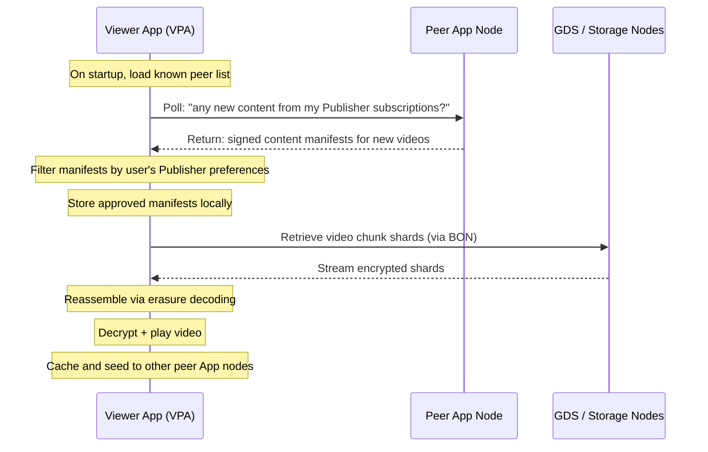
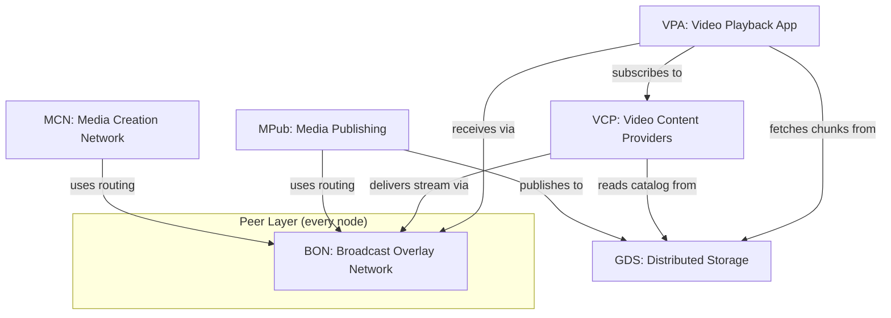

# GBN-ARCH-000 — Veritas: Top-Level System Architecture (Lattice)

**Document ID:** GBN-ARCH-000  
**Architecture Codename:** Lattice  
**Version:** 0.1 (Draft)  
**Status:** In Review  
**Last Updated:** 2026-04-07  
**Related:** [GBN-REQ-000](../requirements/GBN-REQ-000-Top-Level-Requirements.md)

---

## Table of Contents

1. [Architecture Philosophy](#1-architecture-philosophy)
2. [System Context Diagram](#2-system-context-diagram)
3. [Component Architecture Overview](#3-component-architecture-overview)
4. [Data Flow Architecture](#4-data-flow-architecture)
5. [Network Topology](#5-network-topology)
6. [Identity & Cryptography Architecture](#6-identity--cryptography-architecture)
7. [Technology Stack Decisions](#7-technology-stack-decisions)
8. [Deployment Model](#8-deployment-model)
9. [Security Architecture](#9-security-architecture)
10. [Scalability Architecture](#10-scalability-architecture)
11. [Component Dependencies](#11-component-dependencies)
12. [Architecture Decisions Log](#12-architecture-decisions-log)

---

## 1. Architecture Philosophy

### 1.1 Core Architectural Principles

| Principle | Rationale |
|---|---|
| **Layered Trust Isolation** | Each layer sees only what it needs; encryption enforces this mechanically |
| **Content-Addressed Everything** | Content is identified by what it is (hash), not where it lives (IP/URL) |
| **Protocol-First Design** | Define wire protocols before implementations; enable multi-client ecosystems |
| **Pluggable at Every Seam** | Transport, storage, identity, and transport obfuscation are all swappable modules |
| **Asymmetric Trust Network** | Creators/viewers have maximum anonymity; Publishers are accountable identities |
| **Defense in Depth** | No single security layer's failure should compromise the entire system |

### 1.2 The Three Planes

The GBN system is organized around three logically separate planes:

```
┌──────────────────────────────────────────────────────┐
│  CONTENT PLANE                                       │
│  What is transmitted: encrypted video chunks,        │
│  manifests, metadata                                 │
├──────────────────────────────────────────────────────┤
│  ROUTING PLANE                                       │
│  How it gets there: overlay network, DHT, gossip,   │
│  NAT traversal, pluggable transports                 │
├──────────────────────────────────────────────────────┤
│  IDENTITY PLANE                                      │
│  Who is who: public keys, node IDs, Publisher certs, │
│  Content Provider credentials                        │
└──────────────────────────────────────────────────────┘
```

Each plane is architecturally independent — swapping the routing plane (e.g., from Tor-style onion routing to a mixnet) does not affect the content format or identity model.

---

## 2. System Context Diagram



---

## 3. Component Architecture Overview

### 3.1 Component Responsibilities



### 3.2 Node Type Taxonomy

| Node Type | Components Running | Typical Deployment |
|---|---|---|
| **Creator Client** | MCN Client, BON Client | Mobile phone, laptop |
| **Publisher Node** | MPub full stack, BON Server, GDS client | Dedicated server or high-spec desktop |
| **Storage Node** | GDS Storage Daemon | VPS, NAS, always-on desktop |
| **Relay Node** | BON Router | Any internet-connected device |
| **Viewer App** | VPA (includes embedded BON client + HTTP server) | Mobile phone |
| **Content Provider** | VCP stack + BON client | Web server / cloud |

---

## 4. Data Flow Architecture

### 4.1 Creator-to-Publisher Upload Flow



### 4.2 Publisher-to-GDS Distribution Flow

```mermaid
sequenceDiagram
    participant P as Publisher (MPub)
    participant GDS as GDS Network
    participant S1 as Storage Node 1..N

    Note over P: 1. Curate and annotate video
    Note over P: 2. Re-chunk video for storage (different chunk size from MCN)
    Note over P: 3. Apply Reed-Solomon erasure coding (k=14, n=20 default)
    Note over P: 4. Encrypt each storage chunk with content key
    Note over P: 5. Build signed content manifest (Publisher Ed25519 key)

    P->>GDS: Publish manifest to DHT
    P->>S1: Distribute encrypted shards to N storage nodes
    S1-->>P: Acknowledge receipt + integrity hash
    Note over P: 6. Manifest confirmed; content now available in GDS
```

### 4.3 Viewer App Content Discovery Flow



---

## 5. Network Topology

### 5.1 Overlay Network Structure

The GBN operates as an **overlay network** on top of the existing internet. It uses three distinct topological layers:

```
Layer 3: APPLICATION TOPOLOGY
  [Content Manifests, Publisher Catalogs, Peer Subscriptions]
  — Small-world gossip graph; logarithmic propagation

Layer 2: ROUTING TOPOLOGY  
  [Onion circuits, multi-hop packet routing]
  — Random circuits through relay nodes ≥3 hops

Layer 1: TRANSPORT TOPOLOGY
  [Pluggable transport connections between adjacent nodes]
  — obfs4 / WebTunnel connections disguised as HTTPS
```

### 5.2 Peer Topology

```
                          [Publisher]
                         /    |     \
              [RelayNode]  [RelayNode] [RelayNode]
             /      \          |          /    \
        [AppNode] [AppNode] [AppNode] [AppNode] [AppNode]
            \         \       |       /         /
             [StorageNode] [StorageNode] [StorageNode]
```

No node has a complete view of the network. Each node only knows its immediate neighbors (partial view), maintained by the gossip protocol.

### 5.3 Node Discovery Mechanism

1. **Bootstrap**: App ships with a small list of hardcoded bootstrap nodes (minimally centralized).
2. **The Kademlia DHT (Relay Directory)**: Volunteer relay nodes announce their availability by publishing `RelayDescriptors` (containing NodeID, IP, Transport mechanism) to the distributed hash table.
3. **Passive Syncing**: Creators act strictly as read-only "ghosts." They never publish their IP to the DHT. Instead, they passively bulk-download DHT buckets in the background to build a local network map, preventing an adversary from isolating their activity via Query Correlation.
4. **Pre-Flight Reachability Checks**: Relays must mathematically prove outbound global connectivity before announcing themselves to the DHT, automatically pruning nodes trapped behind domestic firewalls and naturally defeating "Blackhole" and sinkhole attempts.

---

## 6. Identity & Cryptography Architecture

### 6.1 Identity Layers

Each actor in the GBN uses a different identity model:

| Actor | Identity Type | Key Type | Public? |
|---|---|---|---|
| **Creator** | Ephemeral — new per upload session | X25519 ECDH (ephemeral) | No — discarded after use |
| **Publisher** | Long-term keypair | Ed25519 (signing) + X25519 (encryption) | Yes — Publisher's public key is their address |
| **Storage Node** | Persistent Node ID | Ed25519 | Yes — advertised in DHT |
| **Relay Node** | Persistent Node ID | Ed25519 | Partial — known to adjacent peers |
| **Content Provider** | Registered identity | Ed25519 + TLS certificate | Yes — public-facing service |
| **App User** | Session-level | Ephemeral X25519 per session | No |

### 6.2 Cryptographic Primitives

| Operation | Algorithm | Rationale |
|---|---|---|
| **Asymmetric Encryption** | X25519 ECDH + AES-256-GCM | Hybrid encryption; Curve25519 for key agreement |
| **Digital Signatures** | Ed25519 | Fast, small signatures; well-audited |
| **Symmetric Encryption** | AES-256-GCM | AEAD with authentication |
| **Content Hashing** | BLAKE3 | Fast; suitable for per-chunk verification |
| **Key Derivation** | HKDF-SHA256 | Standard KDF for deriving session keys |
| **Forward Secrecy** | Double Ratchet (Signal Protocol) | For inter-node session encryption |

### 6.3 Key Management

```
Publisher Key Lifecycle:
  1. Generate Ed25519 keypair offline (air-gapped recommended)
  2. Publish public key via out-of-band channel (website, QR code)
  3. Private key NEVER leaves Publisher's secure enclave
  4. Rotate annually or on compromise; publish new key signed by old key (key transition cert)

Storage Chunk Key Lifecycle:
  1. Content key generated per video by Publisher
  2. Content key encrypted with Publisher's public key (stored in manifest)
  3. Content Provider obtains content key from Publisher (off-band or via access control list)
  4. Storage nodes never see the content key
```

---

## 7. Technology Stack Decisions

### 7.1 Core Protocol Decisions

| Layer | Technology Choice | Alternatives Considered | Decision Rationale |
|---|---|---|---|
| **Peer Discovery** | Kademlia DHT + HyParView gossip | Pastry, Chord, mDNS | Kademlia is battle-tested (BitTorrent); HyParView adds resilient gossip overlay |
| **Onion Routing** | Custom 3-layer onion routing (Tor-inspired) | Full Tor integration, I2P | Tor adds latency; custom protocol lets us optimize for video chunk delivery |
| **Transport Obfuscation** | Pluggable Transports (obfs4, WebTunnel) | Domain fronting (dead), custom proto | PT spec is extensible; WebTunnel is most effective in 2025 |
| **Storage Format** | Content-addressed chunks + IPFS-compatible CIDs | Custom format | IPFS CID compatibility enables reuse of IPFS tooling |
| **Erasure Coding** | Reed-Solomon (k=14, n=20) | XOR parity, Fountain codes | Good balance of overhead (43%) and recovery threshold |
| **Video Streaming** | HLS-over-chunks (custom) | DASH, WebTorrent | HLS is universally supported; wraps around chunk delivery |
| **NAT Traversal** | libp2p's ICE + TURN fallback | Custom STUN/TURN | libp2p is battle-tested for mobile P2P |

### 7.2 Implementation Language Recommendations

| Component | Language | Rationale |
|---|---|---|
| **BON Router / MCN Client core** | Rust | Memory safety; no GC; excellent async I/O; used by Tor (Arti) |
| **Mobile App (VPA)** | Kotlin (Android) / Swift (iOS) with Rust FFI core | Native performance; Rust core shared across platforms. Core heavy-lifting (DHT, onion routing, AES) is compiled from Rust into a shared library. Android integrates this via JNI using a native Kotlin wrapper. |
| **Publisher Node** | Rust / Go | Go for rapid development; Rust for crypto-critical paths |
| **Content Provider API** | Node.js / Go | Standard web API; high ecosystem availability |
| **Storage Node Daemon** | Rust / Go | Long-running daemon; low overhead critical |

### 7.3 Cryptography Libraries

| Library | Language | Usage |
|---|---|---|
| **libsodium / sodiumoxide** | C / Rust | Core crypto primitives (X25519, Ed25519, AES-GCM) |
| **Signal's libsignal** | Rust | Double Ratchet for forward secrecy |
| **OpenSSL / rustls** | Rust | TLS for WebTunnel transport |
| **reed-solomon-erasure** | Rust | Reed-Solomon coding |
| **snow (Noise Protocol)** | Rust | Noise_XX handshake for inter-node sessions |

---

## 8. Deployment Model

### 8.1 Deployment Tiers

```
Tier 0: BOOTSTRAP INFRASTRUCTURE (Minimally Centralized)
  - 5–10 hardcoded bootstrap relay nodes in multiple jurisdictions
  - Public STUN/TURN servers (standard WebRTC infrastructure)
  - Publisher directory hint (a simple signed list of known Publisher public keys)
  → Goal: eliminate all Tier 0 infrastructure dependencies over time

Tier 1: PUBLISHER NODES
  - Dedicated servers (VPS or bare metal) in censor-resistant jurisdictions
  - Run full MPub stack + BON relay
  - Minimum 2 nodes for redundancy

Tier 2: STORAGE NODES
  - VPS, NAS, or always-on desktops
  - Run GDS Storage Daemon only
  - Geographically distributed across ≥5 countries

Tier 3: RELAY NODES
  - Any internet-connected device with the BON daemon
  - Desktop apps, servers, Raspberry Pis
  - No persistent state; pure routing function

Tier 4: APP NODES
  - Mobile phones running the VPA
  - Act simultaneously as: viewer, relay, storage cache
  - Most constrained; battery and bandwidth aware
```

### 8.2 Mobile App Constraints

| Constraint | Impact | Mitigation |
|---|---|---|
| **iOS Background Execution Limits** | Apple strictly limits persistent background TCP connections | iOS devices cannot act as reliable relay/DHT nodes without being killed by the OS. iOS is strictly viewer-only in Phase 1. |
| **CGNAT on Cellular** | No incoming connections without TURN | Mandatory TURN relay registration on mobile startup |
| **Battery Life** | Continuous keep-alives drain battery | Adaptive keep-alive intervals; WiFi-only mode for heavy operations |
| **App Store Policies (iOS)** | Apple historically bans BitTorrent-style P2P distribution and relay apps | iOS must remain viewer-only to comply with App Store rules. |
| **No Global iOS Sideloading** | Lack of global sideloading prevents censorship-resistant app distribution on iOS | Android (sideload + F-Droid + share-to-install) is the primary target. Alternative iOS distribution (e.g., AltStore in the EU) offers limited fallback, but cannot support global resistance. |

### 8.3 Network Diagram

```
Internet (with censorship)
│
├── [Bootstrap Nodes] — hardcoded seed IPs (5-10 globally)
├── [Publisher Nodes] — identified by public key, addressed via BON
│   └── [MPub Daemon + BON Relay]
│
├── [Storage Nodes] — distributed across jurisdictions
│   └── [GDS Daemon]
│
├── [Relay Nodes] — volunteer routers
│   └── [BON Daemon (routing only)]
│
└── [App Nodes] — mobile viewers/seeders
    └── [VPA + embedded BON client + mini HTTP server]
```

---

## 9. Security Architecture

### 9.1 Encryption Layers

```
Layer 4 (Application): Video encrypted with Publisher public key (end-to-end)
Layer 3 (Onion):       Each relay hop's routing info encrypted with relay's key
Layer 2 (Session):     Noise_XX handshake per inter-node session (forward secrecy)
Layer 1 (Transport):   WebTunnel / obfs4 (DPI-resistant transport obfuscation)
```

Even if one layer is stripped or compromised, the remaining layers protect content and identity.

### 9.2 Threat Mitigations

| Threat | Primary Mitigation | Secondary Mitigation |
|---|---|---|
| Traffic Correlation | Cover traffic + timing jitter | Multi-hop routing (min 3 hops) |
| Sybil Attack on DHT | Proof-of-work node registration | Trust-weighted peer selection |
| Telescopic Sinkholes | Layered Cryptographic Handshakes (Node must possess private key to reply) | Pre-flight reachability checks |
| Publisher Identity Spoofing | DHT descriptors strictly validated via Ed25519 PubKey Signatures | Root of Trust established via out-of-band UX (QR Codes / visual hash) |
| Social Engineering (Fake Apps/QR) | UI/UX Visual "Publisher Fingerprints" | Sovereign Software Supply Chain (M-of-N signing) |
| Chunk Poisoning | BLAKE3 per-chunk integrity check | Multi-source chunk downloading |
| Publisher Key Compromise | Key rotation with signed transition cert | Revocation via DHT announcement |
| CSAM Distribution | PhotoDNA hash matching at storage nodes | Publisher screening process |
| App Store Removal | F-Droid + sideload + in-network app distribution | Multiple app identities / rebranding capability |

### 9.3 Audit & Transparency

- All cryptographic protocols SHALL be publicly documented
- Protocol implementations SHALL be open-source and independently auditable
- No "security through obscurity" — obfuscation is in the transport layer only, not in the cryptographic design

---

## 10. Scalability Architecture

### 10.1 DHT Scaling

The Kademlia DHT scales to millions of nodes with O(log N) lookups. Key design choices:

- **Bucket size k=20** (BitTorrent standard)
- **XOR metric** for node distance
- **Periodic bucket refresh** to handle churn
- **Signed announcements** — no unauthenticated writes to DHT

### 10.2 Storage Scaling

```
Storage Capacity Growth Model:
  - Each new Storage Node contributes quota (e.g., 100GB pledged)
  - Erasure ratio: 20/14 = 1.43x overhead
  - 1000 nodes × 100GB / 1.43 ≈ 70TB effective storage
  - 10,000 nodes ≈ 700TB effective storage
  - 100,000 nodes ≈ 7PB effective storage
```

### 10.3 Bandwidth Scaling

- Content is served peer-to-peer after initial seeding — Publisher bandwidth grows only with unique content, not viewers
- Popular content benefits from many seeders; unpopular content relies on dedicated storage nodes
- The BON routing layer incurs ~3x bandwidth overhead (3-hop routing); offset by distributed load

---

## 11. Component Dependencies



**Critical path**: BON is a dependency of every other component. It must be the most stable and well-tested subsystem.

---

## 12. Architecture Decisions Log

| ID | Decision | Rationale | Date | Status |
|---|---|---|---|---|
| ADR-001 | Use Rust as primary implementation language for protocol core | Memory safety, no GC, FFI to mobile | 2026-04-07 | Accepted |
| ADR-002 | Adopt Noise Protocol Framework (snow) for inter-node handshakes | Simpler than TLS; designed for P2P; forward secrecy | 2026-04-07 | Accepted |
| ADR-003 | Use Reed-Solomon (k=14, n=20) as default erasure coding | 43% overhead; tolerates 30% node loss | 2026-04-07 | Accepted |
| ADR-004 | Use Kademlia DHT for peer/content discovery | Battle-tested; BitTorrent compatible | 2026-04-07 | Accepted |
| ADR-005 | Pluggable transport architecture (not hardcoded obfs4) | Adapt to censors without protocol redesign | 2026-04-07 | Accepted |
| ADR-006 | Android-first mobile app; iOS viewer-only in Phase 1 | iOS background restrictions incompatible with relay role | 2026-04-07 | Proposed |
| ADR-007 | Reputation-based (not token/blockchain) incentive for storage nodes in Phase 1 | Avoids regulatory risk of token issuance; simpler to bootstrap | 2026-04-07 | Proposed |
| ADR-008 | Publisher uses Ed25519 long-term keypair as primary identity | Deterministic; small key size; standard across libsodium, Signal | 2026-04-07 | Accepted |
