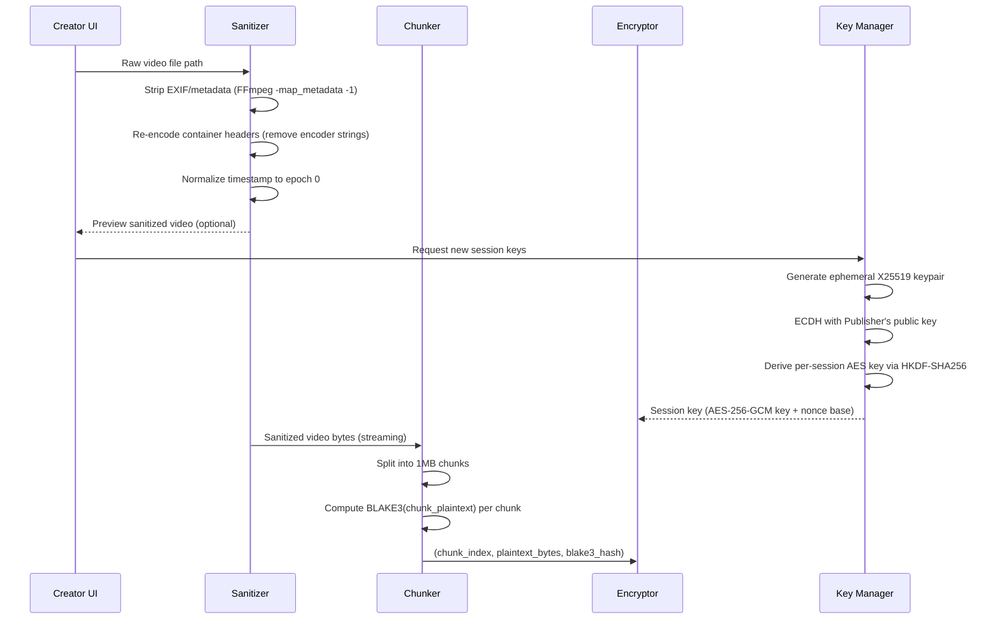
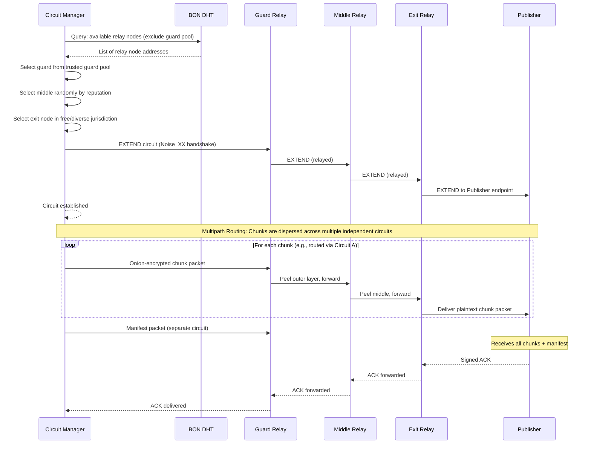

# GBN-ARCH-001 — Media Creation Network: Architecture

**Document ID:** GBN-ARCH-001  
**Version:** 0.1 (Draft)  
**Status:** In Review  
**Last Updated:** 2026-04-07  
**Requirements:** [GBN-REQ-001](../requirements/GBN-REQ-001-Media-Creation-Network.md)  
**Parent Architecture:** [GBN-ARCH-000](GBN-ARCH-000-System-Architecture.md)

---

## 1. Overview

The Media Creation Network (MCN) architecture is designed around a single guiding principle: **the Creator's identity must be cryptographically unrecoverable** even in the face of a fully compromised relay network. This is achieved through a combination of:

- **Hybrid end-to-end encryption**: Only the Publisher can decrypt the final content
- **Onion-layered routing metadata**: No relay node sees both source and destination
- **Pre-upload sanitization**: All device-identifying information removed before a single byte leaves the device
- **Ephemeral session keys**: Creator's crypto identity exists only for the duration of one upload

---

## 2. Component Diagram

```
┌─────────────────────────────────────────────────────────────┐
│                  MCN Client (Creator's Device)              │
│                                                             │
│  ┌───────────────┐   ┌─────────────────────┐  ┌───────────┐ │
│  │ Video Capture │──▶│  Metadata Stripper  │─▶│  Chunker │ │
│  │   / Import    │   │ + Visual Anonymizer │  │(1MB def.) │ │
│  └───────────────┘   └─────────────────────┘  └─────┬─────┘ │
│                                                      │      │
│  ┌──────────────────────────┐                        ▼      │
│  │ Key Manager              │                 ┌────────────┐│
│  │ (ephemeral ECDH)         │────────────────▶│ Per-Chunk  ││
│  └──────────────────────────┘                 │ Encryptor   ││
│                                               │(AES-256-GCM)││
│                                               └─────┬──────┘│
│                                                     │       │
│                                                     ▼       │
│                                              ┌─────────────┐│
│                                              │ Onion Packet││
│                                              │   Builder   ││
│                                              └─────┬───────┘│
│                                                    │        │
│  ┌──────────────────────────┐                      ▼        │
│  │ Ack Receiver             │               ┌──────────────┐│
│  │ & Progress UI            │◀── ── ── ── ─│ Circuit Mgr   ││
│  └──────────────────────────┘ signed ack    │ (multi-path) ││
│                               (via BON)     └─────┬────────┘│
└────────────────────────────────────────────────────┼─────────┘
                                                     │
                ┌────────────────────────────────────▼────────┐
                │         Broadcast Overlay Network (BON)     │
                │                                             │
                │  ┌───────────┐   ┌───────────┐  ┌──────────┐│
                │  │ Relay 1   │──▶│ Relay 2   │─▶│ Relay 3 ││
                │  │ (guard)   │   │ (middle)  │  │ (exit)   ││
                │  └───────────┘   └───────────┘  └────┬─────┘│
                └───────────────────────────────────────┼─────┘
                                                        │
                ┌───────────────────────────────────────▼───────┐
                │                 Publisher (MPub)              │
                │                                               │
                │          ┌────────────────────────┐           │
                │          │  Chunk Receiver        │           │
                │          │  & Buffer              │           │
                │          └────────────────────────┘           │
                └───────────────────────────────────────────────┘
```

---

## 3. Data Flow

### 3.1 Pre-Processing Pipeline



### 3.2 Encryption & Packet Build

```
Per-Chunk Processing:
┌─────────────────────────────────────────┐
│ Plaintext Chunk (1MB)                   │
│ BLAKE3 Hash = H(plaintext)              │
│                                         │
│ Encrypt: AES-256-GCM                    │
│   Key:   session_key                    │
│   Nonce: nonce_base XOR chunk_index     │
│   AAD:   session_id || chunk_index      │
│                                         │
│ Encrypted Chunk Packet:                 │
│  [session_id(16)] [chunk_index(4)]      │
│  [total_chunks(4)] [hash(32)]           │
│  [ciphertext] [gcm_tag(16)]             │
└─────────────────────────────────────────┘
         │
         ▼
Onion Wrapping (per relay hop):
  Layer 3 (guard): encrypt(packet, relay1_pubkey)
  Layer 2 (middle): encrypt(layer3, relay2_pubkey)
  Layer 1 (exit): encrypt(layer2, relay3_pubkey)
```

### 3.3 Circuit Construction & Upload



---

## 4. Protocol Specification

### 4.1 Session Initialization

```
UPLOAD_INIT message (sent to Publisher via BON):
{
    ephemeral_pubkey:  X25519PublicKey   // Creator's ephemeral key
    publisher_pubkey:  Ed25519PublicKey   // Which Publisher key was used
    session_id:        [16]u8             // Random session identifier
    total_chunks:      u32
    content_hash:      BLAKE3Hash         // hash of full sanitized video
    timestamp:         u64                // Unix timestamp
}

Encrypted with:
  X25519(ephemeral_privkey, publisher_x25519_pubkey)
  → HKDF-SHA256 → AES-256-GCM key
```

### 4.2 Chunk Packet Wire Format

```
Field               Size        Description
───────────────────────────────────────────────────────
session_id          16 bytes    Links chunk to UPLOAD_INIT
chunk_index         4 bytes     0-indexed position in sequence
total_chunks        4 bytes     Total number of chunks
chunk_hash          32 bytes    BLAKE3 of plaintext chunk (for verification)
gcm_nonce           12 bytes    nonce_base XOR chunk_index
ciphertext          variable    AES-256-GCM encrypted chunk body
gcm_auth_tag        16 bytes    GCM authentication tag
```

### 4.3 Acknowledgment Protocol

```
Publisher acknowledges each chunk after hash verification:
CHUNK_ACK {
    session_id:   [16]u8
    chunk_index:  u32
    status:       enum { OK, INTEGRITY_FAIL, RETRY }
    timestamp:    u64
    signature:    Ed25519Signature  // signed with Publisher private key
}

Sent via reverse BON circuit (different from upload circuit).
```

---

## 5. Technology Choices

| Component | Technology | Rationale |
|---|---|---|
| **Metadata Stripping** | FFmpeg (`-map_metadata -1 -c copy`) | Best-in-class; lossless; handles all container formats |
| **Visual Anonymization** | OpenCV + YOLO v8 face detection (optional) | Well-tested; can run on-device without network |
| **Encryption** | libsodium (crypto_box_easy, ChaCha20-Poly1305) | Audited; cross-platform; simple API |
| **BLAKE3 Hashing** | `blake3` crate (Rust) | 10x faster than SHA-256; SIMD-optimized |
| **Key Exchange** | X25519 ECDH via libsodium | Standard; ~24ms per exchange |
| **Circuit Management** | Custom Rust async state machine | tor-circuit-rs approach, simplified for video chunks |
| **MCN Client UI** | Android native Kotlin + Rust FFI core | Performance-critical crypto in Rust; UI in Kotlin |

---

## 6. Deployment Model

```
Creator Device (Android / Desktop)
  ├── MCN Client App
  │   ├── Rust Core Library (crypto, chunking, circuit mgmt)
  │   ├── Android UI (Kotlin)
  │   └── Local-only staging directory (encrypted)
  └── BON Client (embedded)
      └── Connects to relay pool via WebTunnel transport
```

**Key constraint**: All pre-processing happens on-device. No component of the MCN pipelines runs in the cloud. The creation of a network connection happens only after the video is fully sanitized and chunked.

---

## 7. Security Architecture

### 7.1 Key Hierarchy

```
Publisher's Long-Term Ed25519 Keypair
  └── Publisher's X25519 Encryption Key (derived or separate)

Creator's Ephemeral X25519 Keypair (per upload)
  └── X25519 DH with Publisher X25519 key
      └── HKDF-SHA256("MCN-v1", dh_output, session_id)
          └── AES-256-GCM session key (per upload)
              └── Nonce derived per chunk: nonce_base XOR chunk_index
```

### 7.2 Threat Mitigations

| Attack | Mitigation Detail |
|---|---|
| **Traffic correlation** | Randomized timing jitter (50–500ms) + optional cover traffic between chunks |
| **First-hop deanonymization** | Guard node selection from high-reputation pool; guard rotated monthly |
| **Video metadata fingerprint** | FFmpeg strips ALL metadata; container is remuxed (not just metadata deleted) |
| **Codec fingerprint (e.g., iPhone encoder)** | `libx264` force-re-encode with `--params` stripped if codec fingerprinting detected |
| **Chunk size traffic analysis** | Chunks padded to standard sizes; fractional last chunk padded to chunk_size |

---

## 8. Scalability & Performance

| Metric | Target | Mechanism |
|---|---|---|
| Upload throughput | 500MB in < 30 min on 1Mbps | Parallel multi-path routing; multiple circuits |
| Memory usage during chunking | < 500MB for 4GB video | Streaming chunker; only 2 chunks in memory at a time |
| Circuit build time | < 2 seconds | Pre-built standby circuits; circuit pool maintained |
| CPU usage for encryption | < 20% on mid-range Android | ChaCha20-Poly1305 is SIMD-optimized; hardware AES on modern phones |

---

## 9. Dependencies

| Component | Depends On |
|---|---|
| **MCN** | **BON** — for all packet routing |
| **MCN** | **DHT** (via BON) — for Publisher address resolution |
| **MCN** | Publisher's public key — pre-shared out-of-band |
