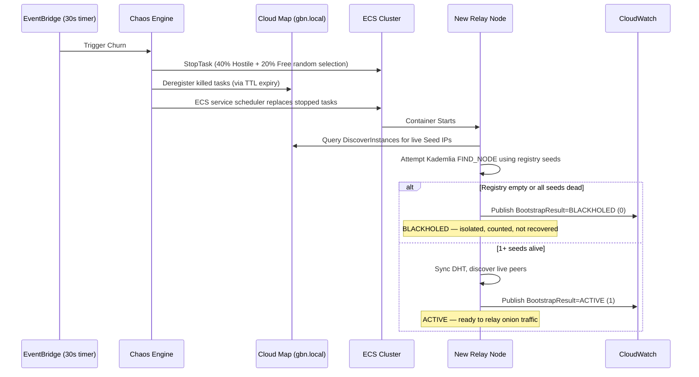
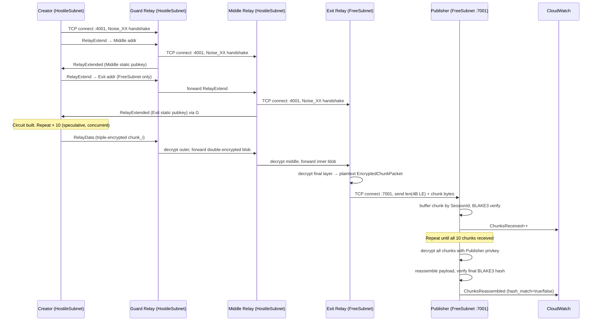

# GBN-PROTO-004 — Prototyping Plan: Phase 2 — Full Onion Circuit & Video Delivery Test

**Document ID:** GBN-PROTO-004  
**Phase:** 2 (Full Circuit + Publisher Delivery)  
**Status:** Draft  
**Last Updated:** 2026-04-15  
**Depends On:** Phase 1 N=100 Gossip Validation (completed 2026-04-14, `GBN-PROTO-004-Phase1-Serverless-Scale-Plan.md`)

---

## 1. Phase Goal

**Prove that the GBN Broadcast Overlay Network (BON) can transmit a real video payload from a Creator node to a Publisher node via a full telescopic onion circuit, routed across 10 disjoint multipath circuits through live ECS Fargate relay nodes — while surviving the same aggressive Chaos Engine churn, geofencing, and node blackholing conditions validated in Phase 1.**

Phase 1 proved the gossip/discovery layer: 100 Fargate nodes deploy, register, converge, and sustain gossip bandwidth through continuous 40%/20% HostileSubnet/FreeSubnet churn. The gossip mesh, Cloud Map discovery, and PlumTree broadcast are confirmed baselines.

Phase 2 adds the full protocol stack **on top of** that baseline:

1. Creator discovers FreeSubnet Exit Relays via Cloud Map, builds 10 telescopic Noise_XX onion circuits through live ECS relay nodes.
2. A deterministic synthetic 10 MB video payload is chunked into 10 pieces and distributed across the 10 circuits — one chunk per path.
3. Exit relays (FreeSubnet only) decrypt the final onion layer and TCP-forward the plaintext chunk to the Publisher's `mpub-receiver` listener.
4. Publisher buffers chunks by session, verifies BLAKE3 integrity per-chunk, decrypts with its private key, and reassembles the complete file.
5. All Phase 1 infrastructure parameters are **retained unchanged**. This test is strictly additive — a Phase 1 gossip regression is a Phase 2 failure.

---

## 2. Test Architecture & Environment

### 2.1 Serverless Infrastructure (AWS Fargate)

Standard AWS Lambda cannot listen for incoming TCP/UDP P2P connections. Therefore, the test uses **AWS ECS Fargate** (Serverless Containers) to deploy the network.

* Phase 2 runs at **N=100 relay nodes only**. N=500 and N=1000 scale runs are deferred until Phase 2 circuit delivery is confirmed at N=100.
* The Creator and Publisher nodes are also deployed as dedicated Fargate tasks.
* CloudFormation stack reused from Phase 1: `gbn-proto-phase1-scale-n100` (same stack name, updated template).

### 2.2 Geo-Fencing Escape Simulation (The 10% Rule)

The VPC is partitioned to simulate a national firewall — **unchanged from Phase 1:**

* **HostileSubnet:** Contains the Creator and 90% of the active Relay nodes (90 hostile relays at N=100).
* **FreeSubnet:** Contains the Publisher and exactly 10% of the active Relay nodes (10 free/exit relays at N=100).
* **The Geofence:** Security Groups strictly deny all direct inbound TCP traffic to the Publisher from the `HostileSubnet`. The Security Group allows Publisher TCP port 7001 (`mpub-receiver`) **only from `FreeSubnetCidr` (10.0.3.0/24)**.

The Creator cannot deliver chunks to the Publisher directly or via HostileSubnet relay nodes. Every chunk must traverse through at least one FreeSubnet Exit Relay before reaching the Publisher. This constraint is enforced at the AWS Security Group level and cannot be bypassed by software.

#### Infrastructure Diagram

```
+------------------------------------------------------------------------------------+
| AWS Cloud (us-east-1)                                                              |
|                                                                                    |
|  +---------------------------- Test VPC (10.0.0.0/16) --------------------------+  |
|  |                                                                              |  |
|  |  +-------------------------------+  +--------------------------------------+ |  |
|  |  | Hostile Subnet (10.0.1.0/23) |   | Free Subnet (10.0.3.0/24)            | |  |
|  |  | 90% capacity                 |   | 10% capacity                         | |  |
|  |  |                              |   |                                      | |  |
|  |  | Creator node (Fargate)       |   | Exit relays (Fargate), 10 nodes      | |  |
|  |  | - Builds 10 onion circuits   |   | - Decrypt final onion layer          | |  |
|  |  | - Uploads chunked payload    |   | - TCP-forward to publisher           | |  |
|  |  |                              |   |                                      | |  |
|  |  | Relay nodes (Fargate), 90    |   | Publisher node (Fargate)             | |  |
|  |  | - Guard hops (hop 1)         |   | - mpub-receiver :7001                | |  |
|  |  | - Middle hops (hop 2)        |   | - BLAKE3 verify + reassemble         | |  |
|  |  +---------------+--------------+  +-------------------+-------------------+ |  |
|  |                  |                                     | Allowed: TCP 7001   |  |
|  |                  +----- Multi-hop onion path ----------+                     |  |
|  |                                                                              |  |
|  |  Security Group geofence:                                                    |  |
|  |  - Blocks HostileSubnet -> Publisher TCP (all ports)                         |  |
|  |  - Allows FreeSubnet -> Publisher TCP port 7001 only                         |  |
|  +------------------------------------------------------------------------------+  |
|                                                                                    |
|  Chaos Engine (Lambda / EventBridge):                                              |
|  - Stops/starts Hostile relay tasks every 30s (40% churn)                          |
|  - Stops/starts Free exit relay tasks every 30s (20% churn)                        |
+------------------------------------------------------------------------------------+
```

---

## 3. The "Chaos Engine" & Node Churn

To simulate mobile Android devices turning on and off, an AWS EventBridge-triggered Lambda known as the **Chaos Engine** continuously manipulates the ECS cluster. **These parameters are retained unchanged from Phase 1.**

### 3.1 The Seed State & Convergence Window

1. The test begins by booting **30%** of the target node count (30 nodes at N=100).
2. These initial nodes act as the "SeedFleet". They register their private IP into the **AWS Cloud Map** service discovery registry (`gbn.local`) on boot.
3. **Stabilization Gate 1:** The deployment script polls ECS running task count until >= 90% of the SeedFleet count reports `RUNNING`. Only after this convergence window does the network scale to full N=100.
4. **Stabilization Gate 2:** After scaling to full N=100, the chaos/upload script polls ECS task count until >= 90% of the full desired count is `RUNNING`. Only then is the Chaos Engine enabled and the circuit build triggered.

For this plan, checkpoint execution uses a **30% seeded** mesh with a **27/3 Hostile/Free** split.

### 3.2 Checkpoint Matrix (N=100, 30% seeded)

#### Milestone 0: One-hop Onion forwarding

| Checkpoint | Chaos Engine | Circuit Hops | Upload Size | Pass Criteria |
|---|---|---|---|---|
| M0 | Disabled | `GBN_CIRCUIT_HOPS=1` | `GBN_UPLOAD_SIZE_BYTES=1_048_576` (1 MB) | At least one chunk delivered through a single-hop onion path and reassembled at publisher; `ChunksReceived >= 1`, `ChunksReassembled >= 1`, `hash_match = 1` |

#### Milestone 0.5: Two-hop Onion forwarding

| Checkpoint | Chaos Engine | Circuit Hops | Upload Size | Pass Criteria |
|---|---|---|---|---|
| M0.5 | Disabled | `GBN_CIRCUIT_HOPS=2` | `GBN_UPLOAD_SIZE_BYTES=1_048_576` (1 MB) | At least one chunk delivered through a two-hop onion path and reassembled at publisher; `ChunksReceived >= 1`, `ChunksReassembled >= 1`, `hash_match = 1` |

#### Phase 2 delivery checkpoints (publisher-received)

| Checkpoint | Chaos Engine | Upload Size | Expected Chunks | Pass Criteria |
|---|---|---|---|---|
| C1 | Disabled | `GBN_UPLOAD_SIZE_BYTES=1_048_576` (1 MB) | 1 | Circuit build succeeds, `ChunksReceived >= 1`, `ChunksReassembled >= 1`, `hash_match = 1` |
| C2 | Disabled | `GBN_UPLOAD_SIZE_BYTES=10_485_760` (10 MB) | 10 | Circuit build succeeds, `ChunksReceived >= 10`, `ChunksReassembled = 10`, `hash_match = 1` |
| C3 | Enabled | `GBN_UPLOAD_SIZE_BYTES=1_048_576` (1 MB) | 1 | Same as C1 while chaos is active |
| C4 | Enabled | `GBN_UPLOAD_SIZE_BYTES=10_485_760` (10 MB) | 10 | Same as C2 while chaos is active |

Current checkpoint status from latest results (`prototype/gbn-proto/results/scale-gbn-proto-phase1-scale-n100-20260414-222311-metrics.json`):
- M0: Not achieved
- M0.5: Not achieved
- C1: Not achieved
- C2: Not achieved
- C3: Not achieved
- C4: Not achieved

### 3.3 Subnet-Aware Aggressive Churn

Every **~30 seconds**, the Chaos Engine randomly terminates a percentage of running Fargate tasks and the ECS service scheduler spins up replacements. It applies **independent churn rates** per subnet to ensure the geofence bypass simulation remains viable:

| Subnet | Churn Rate | Purpose |
|--------|-----------|---------|
| **HostileSubnet** | **40%** | Simulates aggressive mobile device churn |
| **FreeSubnet** | **20%** | Lower rate preserves exit relay availability for circuit routing |

Note: Circuit builds in Phase 2 begin **after** gossip stabilization (`GBN_CIRCUIT_DELAY_SECS=60`). Circuits are constructed on top of an already-churning mesh — this is an intentional stress test of the speculative dialer and circuit rebuild logic.

#### Churn Lifecycle Diagram



---

## 4. Stale Seed Blackholing & Peer Tracking Limits

In a network of millions of nodes, a single mobile device cannot track the entire network state. **These parameters are retained unchanged from Phase 1.**

### 4.1 Configurable Tracking Limit

Relay nodes are configured with a `MAX_TRACKED_PEERS` parameter (`GBN_MAX_TRACKED_PEERS`, tested at 50, 100, 200). This bounds the Kademlia `MemoryStore` and the PlumTree gossip dedup cache.

### 4.2 Stale Seed Bootstrapping

When the Chaos Engine spins up a new node, its entrypoint script (`entrypoint.sh`) injects it with a snapshot of live IPs from Cloud Map at container start. Because of the aggressive 40%/20% churn, many of those IPs may already be dead by the time the new node dials them. The node must attempt contact with surviving seeds and immediately refresh its DHT to catch up to the current network state.

### 4.3 The Blackhole Effect

If a new node boots and **all** of its injected seed IPs have already been terminated, the node is permanently isolated ("blackholed"). In the real world, this simulates a user needing to scan a new QR code to rejoin the network.

**Phase 2 does not attempt to auto-recover blackholed nodes.** The Blackhole Rate is explicitly measured as a test metric. A node that blackholes during the circuit build window cannot serve as a Guard, Middle, or Exit relay — this is captured in the Circuit Build Success Rate metric.

---

## 5. Video Transmission & Full Onion Circuit Routing

This section describes the end-to-end Phase 2 circuit protocol. It extends Section 5 of the Phase 1 test spec, which described the target architecture. In Phase 2, this is fully implemented and executed.

### 5.1 Synthetic Test Video Payload

There is no video file on disk inside an ECS Fargate container. Phase 2 uses a **deterministic synthetic payload** generated at Creator startup:

* **Generation:** ChaCha20Rng seeded with `0xGBN_PHASE2_SEED` (fixed constant), producing pseudo-random bytes.
* **Default size:** 10 MB (`GBN_UPLOAD_SIZE_BYTES=10485760`).
* **Integrity verification:** Because the seed is fixed and deterministic, the Publisher can independently compute the expected BLAKE3 hash without receiving the original. Any bit corruption in transit will be detected.
* **Configurable:** `GBN_UPLOAD_SIZE_BYTES` env var on the `CreatorTaskDefinition` allows payload scaling in future runs.

This synthetic payload exercises the full chunking, encryption, routing, decryption, and reassembly pipeline identically to a real video file.

### 5.2 Video Chunking

The 10 MB payload is split by the `mcn-chunker` crate into exactly **10 distinct chunks**:

* Each chunk is approximately 1 MB (final chunk may differ by alignment).
* Each chunk is assigned a `SessionId` (random UUID per upload session) and a `chunk_index` (0–9).
* The `SessionId` groups all 10 chunks at the Publisher for reassembly.

### 5.3 Publisher Key Distribution

Before the Creator can encrypt chunks, it must know the Publisher's X25519 public key:

1. Publisher container reads `GBN_PUBLISHER_KEY_HEX` (32-byte hex-encoded seed) from AWS SSM Parameter Store (`/gbn/proto/publisher-key-hex`).
2. Publisher derives its X25519 keypair from the seed and registers its public key as a Cloud Map attribute: `pub_key_hex`, with attribute `role=publisher`.
3. Creator calls `DiscoverInstances` filtered by `role=publisher` to retrieve the Publisher's address and public key before constructing any circuits.

The Publisher keypair is generated once before the test run and stored in SSM. It persists across Publisher task restarts within the same test run.

### 5.4 Telescopic Onion Circuit Construction

After gossip mesh stabilization (60 seconds post-boot, `GBN_CIRCUIT_DELAY_SECS=60`), the Creator:

1. Calls `discover_free_subnet_exits()` — queries Cloud Map `DiscoverInstances` filtered by `GBN_SUBNET_TAG=FreeSubnet` to get the 10 live Exit Relay candidates.
2. Queries the DHT for all live relay peers as Guard and Middle candidates.
3. Calls `build_circuits_speculative()` (`circuit_manager.rs:417`) targeting 10 successful circuits, with up to 30 concurrent speculative dials.

Each circuit is a **3-hop telescopic Noise_XX onion**:

| Hop | Role | Subnet | Construction |
|-----|------|--------|-------------|
| 1st | **Guard** | HostileSubnet | Creator dials directly via TCP port 4001 |
| 2nd | **Middle** | HostileSubnet | Creator sends `RelayExtend` through Guard; Guard dials Middle |
| 3rd | **Exit** | **FreeSubnet only** | Creator sends `RelayExtend` through Guard→Middle; enforced by `select_exit_candidates()` geofence filter |

Each hop performs a full **Noise_XX mutual handshake** (`relay_engine.rs` `RelayExtend` handler): the Creator's handshake state is telescoped through the already-established hops, establishing independent forward-secret session keys at each layer. The `RelayExtended` response carries the next-hop's static public key for identity verification.

**Geofence enforcement is at two levels:**
1. **Protocol level:** `select_exit_candidates_from_descriptors()` only returns nodes whose `RelayDescriptor.subnet_tag == "FreeSubnet"` (DHT-signed by each node on boot).
2. **Network level:** AWS Security Group blocks all direct TCP from HostileSubnet to Publisher — even if a node misidentifies its subnet tag, the packet cannot arrive.

### 5.5 10-Path Multipath Routing with Disjointness Constraint

`build_circuits_speculative()` launches up to 30 concurrent circuit dials and keeps the first 10 that succeed:

* **Disjointness constraint (hard):** No relay IP address may appear in more than one simultaneous path. Guard, Middle, and Exit for all 10 circuits must be 30 unique relay nodes.
* At N=100 with 10 FreeSubnet exit relays, this requires all 10 exits plus 20 unique HostileSubnet relays for guard/middle slots.
* If fewer than 10 disjoint paths can be built (e.g., due to Chaos Engine having reduced exit count), the Creator logs the shortfall and proceeds with however many circuits were built, reporting `CircuitBuildResult=0` for the deficit attempts.

Path disjointness is verified after all circuits are built:

```
Circuit 0: guard=10.0.1.12 middle=10.0.1.44 exit=10.0.3.5
Circuit 1: guard=10.0.1.23 middle=10.0.1.67 exit=10.0.3.8
...
Circuit 9: guard=10.0.1.91 middle=10.0.1.33 exit=10.0.3.2

Path diversity: PASS (unique=30 / total=30)
```

`PathDiversityResult` CloudWatch metric is published as 1.0 (all disjoint) or 0.0 (relay overlap detected).

### 5.6 Chunk Encryption & Onion Delivery

For each chunk `i` (0–9):

1. **Application-layer encryption:** Chunk bytes encrypted with Creator→Publisher X25519 session key (AES-GCM, via `mcn-crypto`). This protects payload confidentiality from relay nodes.
2. **Onion wrapping (triple-layer):**
   - Outermost layer: encrypted for Guard's session key
   - Middle layer: encrypted for Middle's session key
   - Innermost layer: encrypted for Exit's session key
3. `CircuitManager::send_chunk()` assigns `chunk_index % num_circuits` → circuit selection (round-robin). All 10 circuits are used concurrently.
4. Guard receives the triply-encrypted `RelayData` cell, decrypts its layer, forwards the doubly-encrypted blob to Middle.
5. Middle decrypts its layer, forwards the singly-encrypted blob to Exit.
6. Exit decrypts the final layer, recovering the plaintext `EncryptedChunkPacket` bytes (application-encrypted chunk — still opaque to Exit relay).
7. Exit TCP-connects to Publisher at `GBN_PUBLISHER_ADDR` (discovered via Cloud Map `role=publisher` at relay startup), sends 4-byte LE length prefix + chunk bytes.

#### End-to-End Delivery Sequence



### 5.7 Circuit Resilience Under Chaos Engine Churn

The Chaos Engine is active during the circuit build and upload sequence. The circuit layer handles churn via:

* **Heartbeat watchdog:** Each circuit sends a `RelayHeartbeat` PING every 5 seconds and expects a PONG within 10 seconds. A missed PONG marks the circuit dead.
* **In-flight tracking:** The in-flight chunk on a dead circuit is re-queued (`CircuitManager::drain_failures()`).
* **Rebuild:** `process_failures_with_rebuild_from_descriptors()` selects a fresh relay set (excluding dead relay IPs), builds a replacement circuit, and retries the re-queued chunk.
* **Retry cap:** Each chunk is retried at most 3 times before the upload fails for that chunk.

A circuit failure during active upload does **not** fail the session if a replacement circuit can be built within the retry cap. This is the core resilience property under test.

### 5.8 Publisher Reassembly & Integrity Verification

The Publisher's `mpub-receiver` listener (bound to `0.0.0.0:7001`):

1. Accepts TCP connections from exit relays (Security Group enforces FreeSubnet source only).
2. Reads 4-byte LE length prefix, then that many bytes.
3. Parses `EncryptedChunkPacket`: extracts `SessionId`, `chunk_index`, encrypted chunk bytes.
4. Buffers chunks by `SessionId`. Publishes `ChunksReceived` metric per arrival.
5. On session completion (all 10 chunks for a `SessionId` received): decrypts each chunk with Publisher private key (X25519 → AES-GCM), assembles in order by `chunk_index`.
6. Computes BLAKE3 hash of reassembled payload, compares against expected hash (derived independently from `0xGBN_PHASE2_SEED` + `GBN_UPLOAD_SIZE_BYTES`).
7. Publishes `ChunksReassembled` metric: count of chunks in the session, `hash_match=true/false`.

---

## 6. Telemetry & Success Metrics

All nodes push custom telemetry to AWS CloudWatch namespace `GBN/ScaleTest`. The final test report captures the following metrics:

| Metric | CloudWatch Name | Published By | Target | Phase |
|--------|----------------|-------------|--------|-------|
| **Goodput vs. Overhead Ratio** | Derived: `(ChunksReassembled × chunk_size_bytes) / (GossipBandwidthBytes + circuit_overhead_estimate)` | — | **>60% goodput** | Phase 2 |
| **Blackhole Rate** | `BootstrapResult` (0=blackholed, 1=active) | All relay nodes | **<5% blackholed** | Phase 1 retained |
| **Time-to-Convergence** | ECS `startedAt` → first `BootstrapResult=1` timestamp delta | All relay nodes | **<15 seconds** | Phase 1 retained |
| **Circuit Build Success Rate** | `CircuitBuildResult` (1=success, 0=failure) | Creator | **>80% of dials succeed** | Phase 1 (now measured) |
| **Path Diversity Verification** | `PathDiversityResult` (1=all disjoint, 0=overlap detected) | Creator | **100% disjoint** | Phase 1 (now measured) |
| **Chunks Reassembled at Publisher** | `ChunksReassembled` | Publisher | **≥1 complete session** | Phase 2 new |
| **BLAKE3 Hash Match** | `ChunksReassembled` with `hash_match=true` | Publisher | **100% of sessions** | Phase 2 new |
| **Exit Relay Chunk Arrivals** | `ChunksReceived` | Publisher | **≥10 arrivals per test run** | Phase 2 new |
| **Gossip Mesh Regression Gate** | `GossipBandwidthBytes` non-zero; `ChunksDelivered` non-zero | All relay nodes | **Both non-zero, sustained through chaos** | Phase 1 regression |

### CloudWatch Metric Dimensions

| Metric Name | Dimensions |
|-------------|-----------|
| `BootstrapResult` | `{Scale, Subnet, NodeId}` |
| `GossipBandwidthBytes` | `{Scale, Subnet}` — aggregate only, no NodeId (avoids CW SEARCH 500-series limit) |
| `ChunksDelivered` | `{Scale, Subnet, NodeId}` |
| `CircuitBuildResult` | `{Scale, NodeId}` |
| `CircuitBuildLatencyMs` | `{Scale, NodeId}` |
| `PathDiversityResult` | `{Scale, NodeId}` |
| `ChunksReassembled` | `{Scale, Subnet}` — aggregate |
| `ChunksReceived` | `{Scale, Subnet}` — aggregate |

### Phase 2 Pass / Fail Gate

**PASS** — all of the following must hold:
- `CircuitBuildResult` Sum / SampleCount > 0.80 (>80% of dial attempts succeed)
- `ChunksReassembled` Sum ≥ 1 (at least one complete session received by Publisher)
- `PathDiversityResult` = 1.0 (all circuits used disjoint relay sets)
- `ChunksReassembled` with `hash_match=true` = 100% of sessions
- `BootstrapResult=0` / all `BootstrapResult` < 0.05 (Blackhole Rate <5%)
- `GossipBandwidthBytes` non-zero at least once during the chaos window (no gossip regression)

**PARTIAL PASS** — chunks reassembled but one gate misses:
- `ChunksReassembled ≥ 1` but `CircuitBuildResult` <80%: circuit instability under chaos — investigate heartbeat/rebuild logic
- `ChunksReassembled ≥ 1` but `PathDiversityResult = 0`: relay overlap detected — speculative dialer disjointness bug
- `ChunksReassembled ≥ 1` but Goodput <60%: gossip overhead is crowding out circuit bandwidth — investigate `GBN_GOSSIP_BPS` tuning

**FAIL** — any of the following:
- `ChunksReassembled = 0`: Publisher never received a complete session — exit relay handoff or Publisher `mpub-receiver` is broken
- `GossipBandwidthBytes = 0` throughout chaos window: Phase 1 gossip regression — the gossip layer broke under Phase 2 changes

---

## 7. Known Architectural Gaps to Address Before Testing

Before executing this test, the following Phase 2 wiring tasks must be completed. See `GBN-PROTO-004-Phase2-Serverless-Scale-Plan.md` for full implementation details.

### Critical Wiring (3 code changes, must all be done)

**P2-1: Creator `Serve` path — wire `build_circuit()`**
- **File:** `prototype/gbn-proto/crates/proto-cli/src/main.rs`
- **Current state:** `Serve { role: "creator" }` runs `run_swarm_until_ctrl_c()` — gossip only. `build_circuit()` is never called from ECS.
- **Required:** After gossip stabilization delay (`GBN_CIRCUIT_DELAY_SECS`), query Cloud Map for FreeSubnet exits, call `build_circuits_speculative()`, then `creator_upload_sequence()` with synthetic payload.

**P2-3: Exit relay — TCP-forward to Publisher `mpub-receiver`**
- **File:** `prototype/gbn-proto/crates/mcn-router-sim/src/relay_engine.rs` lines 228–236
- **Current state:** Exit node logs "received N bytes of payload" and drops. No forwarding occurs.
- **Required:** Replace log-and-drop stub with `TcpStream::connect(GBN_PUBLISHER_ADDR)`, 4-byte length-prefix framing, write chunk bytes to Publisher.

**P2-4: Publisher `Serve` path — run `mpub-receiver` TCP listener**
- **File:** `prototype/gbn-proto/crates/proto-cli/src/main.rs` lines 230–235
- **Current state:** `"publisher" => { tokio::signal::ctrl_c().await? }` — permanent placeholder.
- **Required:** Bind `mpub_receiver::Receiver` on `GBN_MPUB_PORT` (default 7001), load Publisher private key from `GBN_PUBLISHER_KEY_HEX`, register public key in Cloud Map, run reassembly + BLAKE3 verification loop.

### Supporting Changes

**P2-5: New CloudWatch metrics**
- **File:** `prototype/gbn-proto/crates/mcn-router-sim/src/observability.rs`
- Add: `publish_chunks_reassembled()`, `publish_chunks_received()`, `publish_path_diversity()`
- Add to teardown script: query `ChunksReassembled`, `ChunksReceived`, `PathDiversityResult` in output JSON

**P2-7: CloudFormation infrastructure updates**
- **File:** `prototype/gbn-proto/infra/cloudformation/phase1-scale-stack.yaml`
- Add Publisher Security Group inbound rule: TCP 7001 from `FreeSubnetCidr` only
- Add SSM parameter: `PublisherKeyHexParam` → `/gbn/proto/publisher-key-hex` (SecureString)
- Add env vars to `CreatorTaskDefinition`: `GBN_CIRCUIT_DELAY_SECS=60`, `GBN_CIRCUIT_PATHS=10`, `GBN_CIRCUIT_HOPS=3`
- Add env vars to `PublisherTaskDefinition`: `GBN_MPUB_PORT=7001`, `GBN_PUBLISHER_KEY_HEX` (from SSM)
- Add IAM SSM read permission to Publisher task role: `ssm:GetParameter` on `/gbn/proto/*`
- FreeRelay task: resolve `GBN_PUBLISHER_ADDR` at startup via Cloud Map `role=publisher` discovery

---

## 8. Pre-Test Setup & Run Sequence

### Pre-Run (once per test campaign)

```bash
# Generate Publisher keypair
cd prototype/gbn-proto
cargo run --bin gbn-proto -- keygen
# Output: publisher.key (32-byte seed), publisher.pub (X25519 public key)

# Store private key seed in SSM Parameter Store
KEY_HEX=$(xxd -p publisher.key | tr -d '\n')
aws ssm put-parameter \
  --name /gbn/proto/publisher-key-hex \
  --value "$KEY_HEX" \
  --type SecureString \
  --region us-east-1 \
  --overwrite
```

### Test Run Sequence

```bash
# Step 1: Build and push images
bash prototype/gbn-proto/infra/scripts/build-and-push.sh \
  gbn-proto-phase1-scale-n100 us-east-1

# Step 2: Deploy with 30% seed ratio (default is now 30%)
cd prototype/gbn-proto
SEED_PERCENT=30 bash infra/scripts/deploy-scale-test.sh \
  gbn-proto-phase1-scale-n100 100 us-east-1
cd ..

# Step 3: Execute milestones and checkpoints
# Milestone 0: One-hop Onion forwarding
# Precondition: set GBN_CIRCUIT_HOPS=1, GBN_CIRCUIT_PATHS=1,
# GBN_UPLOAD_SIZE_BYTES=1048576 in phase1-scale-stack.yaml
ENABLE_CHAOS=0 bash prototype/gbn-proto/infra/scripts/run-chaos-upload.sh \
  gbn-proto-phase1-scale-n100 us-east-1 "sleep 240"
bash prototype/gbn-proto/infra/scripts/teardown-scale-test.sh \
  gbn-proto-phase1-scale-n100 us-east-1

# Milestone 0.5: Two-hop Onion forwarding
# Precondition: set GBN_CIRCUIT_HOPS=2, GBN_CIRCUIT_PATHS=1,
# GBN_UPLOAD_SIZE_BYTES=1048576 in phase1-scale-stack.yaml
SEED_PERCENT=30 bash prototype/gbn-proto/infra/scripts/deploy-scale-test.sh \
  gbn-proto-phase1-scale-n100 100 us-east-1
ENABLE_CHAOS=0 bash prototype/gbn-proto/infra/scripts/run-chaos-upload.sh \
  gbn-proto-phase1-scale-n100 us-east-1 "sleep 240"
bash prototype/gbn-proto/infra/scripts/teardown-scale-test.sh \
  gbn-proto-phase1-scale-n100 us-east-1

# C1: no-chaos, single chunk (set GBN_UPLOAD_SIZE_BYTES=1048576 in phase1-scale-stack.yaml before deploy)
SEED_PERCENT=30 bash prototype/gbn-proto/infra/scripts/deploy-scale-test.sh \
  gbn-proto-phase1-scale-n100 100 us-east-1
ENABLE_CHAOS=0 bash prototype/gbn-proto/infra/scripts/run-chaos-upload.sh \
  gbn-proto-phase1-scale-n100 us-east-1 "sleep 240"
bash prototype/gbn-proto/infra/scripts/teardown-scale-test.sh \
  gbn-proto-phase1-scale-n100 us-east-1

# C2: no-chaos, multi-chunk (set GBN_UPLOAD_SIZE_BYTES=10485760)
SEED_PERCENT=30 bash prototype/gbn-proto/infra/scripts/deploy-scale-test.sh \
  gbn-proto-phase1-scale-n100 100 us-east-1
ENABLE_CHAOS=0 bash prototype/gbn-proto/infra/scripts/run-chaos-upload.sh \
  gbn-proto-phase1-scale-n100 us-east-1 "sleep 240"
bash prototype/gbn-proto/infra/scripts/teardown-scale-test.sh \
  gbn-proto-phase1-scale-n100 us-east-1

# C3: chaos enabled, single chunk
SEED_PERCENT=30 bash prototype/gbn-proto/infra/scripts/deploy-scale-test.sh \
  gbn-proto-phase1-scale-n100 100 us-east-1
ENABLE_CHAOS=1 bash prototype/gbn-proto/infra/scripts/run-chaos-upload.sh \
  gbn-proto-phase1-scale-n100 us-east-1 "sleep 240"
bash prototype/gbn-proto/infra/scripts/teardown-scale-test.sh \
  gbn-proto-phase1-scale-n100 us-east-1

# C4: chaos enabled, multi-chunk
SEED_PERCENT=30 bash prototype/gbn-proto/infra/scripts/deploy-scale-test.sh \
  gbn-proto-phase1-scale-n100 100 us-east-1
ENABLE_CHAOS=1 bash prototype/gbn-proto/infra/scripts/run-chaos-upload.sh \
  gbn-proto-phase1-scale-n100 us-east-1 "sleep 240"
bash prototype/gbn-proto/infra/scripts/teardown-scale-test.sh \
  gbn-proto-phase1-scale-n100 us-east-1

# Repeat M0 and M0.5 at least 3x each for consistency validation
```
### Expected Output Files

| File | Contents |
|------|----------|
| `results/scale-gbn-proto-phase1-scale-n100-<TIMESTAMP>-metrics.json` | Raw CloudWatch metric values for all 9 success metrics |
| `docs/prototyping/GBN-PROTO-004-Phase2-Scale-Results.md` | Final pass/fail report with metric values and analysis |

---

## 9. Phase 2 Scale Targets & Deferral Policy

| Scale | Status | Condition to Unlock |
|-------|--------|---------------------|
| **N=100** | **Active — Phase 2 target** | Required |
| N=500 | Deferred | Phase 2 N=100 PASS gate must be met in full |
| N=1000 | Deferred | N=500 must pass first |

N=500 and N=1000 runs do not require new code changes — they use the same Phase 2 implementation with the `ScaleTarget` CloudFormation parameter changed. However, they are deferred until N=100 confirms the full circuit protocol is stable under Chaos Engine churn. Premature scale-up would make circuit debug significantly harder and more expensive (~$13/hour at N=1000 vs. ~$1.30/hour at N=100 on Fargate).

