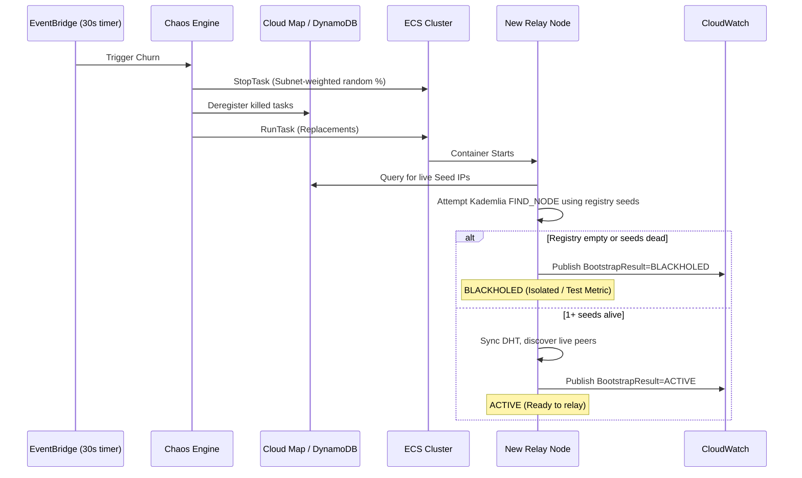

# GBN-PROTO-004 — Prototyping Plan: Phase 1 — Serverless Scale & Churn Test

**Document ID:** GBN-PROTO-004  
**Phase:** 1 (Extended Scale Testing)  
**Status:** Draft  
**Last Updated:** 2026-04-07  
**Depends On:** Phase 1 execution (GBN-PROTO-001)

---

## 1. Phase Goal

**Prove that the GBN Broadcast Overlay Network (BON) can scale to 1,000 active nodes, survive aggressive 30-second node churn, successfully route traffic around simulated national geofencing, and establish baseline metrics for protocol overhead vs. video transfer bandwidth.**

Unlike the initial Phase 1 test (which utilized a static 7-node EC2 layout), this test utilizes a dynamic, serverless AWS Fargate environment. It is designed to aggressively simulate the ephemeral nature of mobile Android devices connecting, dropping offline, and struggling with stale routing tables.

---

## 2. Test Architecture & Environment

### 2.1 Serverless Infrastructure (AWS Fargate)
Standard AWS Lambda cannot listen for incoming TCP/UDP P2P connections. Therefore, the test will use **AWS ECS Fargate** (Serverless Containers) to deploy the network.
* The test will be run in three distinct scale configurations: **100, 500, and 1000 Relay nodes**.
* The Publisher node will also be deployed as a dedicated Fargate task.

### 2.2 Geo-Fencing Escape Simulation (The 10% Rule)
The VPC will be partitioned to simulate a national firewall:
* **HostileSubnet:** Contains the Creator and 90% of the active Relay nodes.
* **FreeSubnet:** Contains the Publisher and exactly 10% of the active Relay nodes.
* **The Geofence:** Security Groups will strictly deny inbound traffic to the Publisher from the `HostileSubnet`. The Creator must dynamically discover and utilize the 10% of relays in the `FreeSubnet` as Exit Nodes to successfully deliver chunks.

#### Infrastructure Diagram
```
┌────────────────────────────────────────────────────────────────────────────┐
│                       AWS Cloud (us-east-1)                               │
│                                                                            │
│  ┌──────────────────────────────────────────────────────────────────────┐  │
│  │                             Test VPC                                 │  │
│  │                                                                      │  │
│  │  ┌────────────────────────────────┐   ┌────────────────────────────┐ │  │
│  │  │ Hostile Subnet (90% Capacity) │   │ Free Subnet (10% Capacity) │ │  │
│  │  │                                │   │                            │ │  │
│  │  │  Creator Node (Fargate)        │   │  Exit Relay Nodes          │ │  │
│  │  │  Relay Nodes (Fargate)         │   │  (Fargate): 10/50/100      │ │  │
│  │  │  90 / 450 / 900 Tasks          │   │  Publisher Node (Fargate)  │ │  │
│  │  └───────────────┬────────────────┘   └──────────────┬─────────────┘ │  │
│  │                  │                                   │               │  │
│  │                  │ Multi-hop                         │ Allowed       │  │
│  │                  └──────────────────────┬────────────┘               │  │
│  │                                         │                            │  │
│  │        Security Group Geofence: Blocks Hostile → Publisher direct   │  │
│  └──────────────────────────────────────────────────────────────────────┘  │
│                                                                            │
│  Chaos Engine (Lambda / EventBridge)                                       │
│    ├─ Starts/Stops Hostile Relay Tasks every 30s                           │
│    └─ Starts/Stops Free Exit Relay Tasks every 30s                         │
└────────────────────────────────────────────────────────────────────────────┘
```

---

## 3. The "Chaos Engine" & Node Churn

To simulate mobile Android devices turning on and off, an AWS Step Function (or Lambda) known as the **Chaos Engine** will continuously manipulate the ECS cluster.

### 3.1 The Seed State
### 3.1 The Seed State & Convergence Window
1. The test begins by booting only **33%** of the target node count (e.g., 330 nodes out of 1000).
2. These initial nodes act as the "SeedFleet". They register themselves into a lightweight **AWS Cloud Map** or **DynamoDB** service discovery registry on boot.
3. **Stabilization Gate:** The test orchestration script polls a health endpoint until >90% of the SeedFleet reports an `ACTIVE` status. Only after this convergence window does the network scale to 100% and the Chaos Engine begin.

### 3.2 Subnet-Aware Aggressive Churn
Every **30 seconds**, the Chaos Engine will randomly terminate a percentage of running Fargate tasks and spin up new ones to replace them. It will deregister killed tasks from the Cloud Map / DynamoDB registry.
To ensure the Geofence bypass simulation remains viable, the Chaos Engine applies **independent churn rates** per subnet (e.g., 40% churn in the `HostileSubnet`, but only 20% in the `FreeSubnet`).

#### Churn Lifecycle Diagram


---

## 4. Stale Seed Blackholing & Peer Tracking Limits

In a network of millions of nodes, a single mobile device cannot track the entire network state. 

### 4.1 Configurable Tracking Limit
The Relay nodes will be configured with a `MAX_TRACKED_PEERS` parameter (e.g., 50, 100, 200). This represents the maximum number of active nodes a given device will keep in its local routing table. 

### 4.2 Stale Seed Bootstrapping
When the Chaos Engine spins up a *new* node, it injects it with a static snapshot of the original SeedFleet IPs. Because of the aggressive 30-second churn, many of these IPs will be dead. The node must attempt to contact surviving seeds and immediately refresh its DHT metadata to "catch up" to the current network state.

### 4.3 The Blackhole Effect
If a new node boots up and *all* of its injected seed IPs have already been terminated by the Chaos Engine, the node will be permanently isolated ("blackholed"). In the real world, this simulates a user needing to scan a new QR code to rejoin the network. **The test will explicitly monitor and measure this Blackhole Rate rather than attempting to artificially auto-recover the nodes.**

---

## 5. Video Transmission & Multipath Routing

During the chaos, the Creator node will attempt to upload a video:
1. The video is chunked into **10 distinct chunks**.
2. The Circuit Manager must dial **10 simultaneous, distinct multi-hop paths** to the Publisher.
3. No two paths may share the same relay nodes.
4. Every path must successfully exit through the 10% `FreeSubnet` to bypass the Security Group geofence.

#### Multipath Geofence Bypass Diagram
```mermaid
graph LR
    Creator["Creator (Hostile Subnet)"]
    Pub["Publisher (Free Subnet)"]
    
    subgraph Hostile Routing
        G1["Guard 1"]
        G2["Guard 2"]
        M1["Middle 1"]
        M2["Middle 2"]
    end
    subgraph Geofence Bypass
        E1["Exit 1 (Free Subnet)"]
        E2["Exit 2 (Free Subnet)"]
    end

    Creator -->|"Chunk 1"| G1 --> M1 --> E1 -->|"Delivered"| Pub
    Creator -->|"Chunk 2"| G2 --> M2 --> E2 -->|"Delivered"| Pub
    Note over Creator,Pub: 10 distinct, concurrently dialed paths
```

---

## 6. Telemetry & Success Metrics

The nodes will push custom telemetry to AWS CloudWatch. The final test report must capture the following metrics across the 100, 500, and 1000 node scales:

| Metric | Description | Target |
|---|---|---|
| **Goodput vs. Overhead Ratio** | Available bandwidth consumed by protocol overhead (DHT gossip, TLS/Noise handshakes, keepalives) vs. available bandwidth used for actual Video Transfer. | > 60% Goodput |
| **Blackhole Rate** | The percentage of newly booted nodes that fail to join the network because their seed list is 100% dead. Evaluated against different `MAX_TRACKED_PEERS` limits. | < 5% |
| **Time-to-Convergence** | How long it takes a newly booted node (with stale seeds) to successfully refresh its DHT and become ready to relay traffic. | < 15 seconds |
| **Circuit Build Success Rate** | Percentage of circuit build attempts that succeed vs. fail (due to selecting a churning node or a geofenced Exit node). | > 80% |
| **Path Diversity Verification** | Confirmation that the 10 video chunks traversed 10 completely disjoint network paths. | 100% |

---

## 7. Known Architectural Gaps to Address Before Testing

Before executing this test, the Phase 1 codebase must be updated to handle the scale:

1. **Gossip Broadcast Storms:** At 1000 nodes, unchecked HyParView or Kademlia gossip will consume 100% of available bandwidth. Dynamic tuning and message batching must be implemented.
2. **Geofence Discovery:** The Kademlia DHT must be updated to store "Subnet/Jurisdiction" tags so the Creator can actively filter and select the 10% of nodes residing in the Free Subnet for its exit hops.
3. **Speculative Dialing:** To find 10 successful distinct paths in a highly churning network, the Circuit Manager must be upgraded to dial *multiple* speculative paths concurrently, keeping the winners and tearing down the losers.