# 🌐 Global Broadcast Network (GBN) — Prototype Workspace

**A decentralized, censorship-resistant video creation, publishing, and distribution platform — designed so truth can travel faster than it can be suppressed.**

> *"The internet treats censorship as damage and routes around it."*
> — John Gilmore

---

## ⚠️ Project Status

This repository is an **active prototype** (`gbn-proto`) for validating core architecture and security assumptions.

- ✅ Core Rust workspace and crate boundaries are in place
- ✅ Integration test scaffolding exists for metadata stripping, multipath reassembly, tamper detection, and end-to-end pipeline tests
- 🚧 CLI orchestration commands are partially implemented (see `crates/proto-cli/src/main.rs`)
- 🚧 Not production-ready; APIs and protocols are expected to evolve during prototyping

If you are looking for full system design docs (requirements, architecture, security), see [`../../docs/`](../../docs/).

---

## Quick Start

### Prerequisites

- Rust 1.77+
- FFmpeg 6.0+
- (Optional for infra simulation) AWS CLI + Docker

### 1) Build the workspace

```bash
cargo build --workspace
```

### 2) Run tests

```bash
cargo test --workspace
```

### 3) Add local test videos (for media pipeline tests)

Place `.mp4` files in [`test-vectors/`](./test-vectors/) (this directory is gitignored).

See [`test-vectors/README.md`](./test-vectors/README.md) for expected files and guidance.

### 4) (Optional) AWS phase infrastructure

For EC2-based prototype runs and teardown, see [`infra/README-infra.md`](./infra/README-infra.md).

---

## Vision & Mission

In many countries, a journalist who records police violence, corruption, or protests faces an impossible choice: **publish and be identified, or stay silent and stay safe**.

Existing options leave major gaps:
- **Mainstream platforms** can remove content centrally and log subpoenaable metadata.
- **Tor + generic file sharing** protects uploader routing but does not provide an integrated publisher trust + distribution pipeline.
- **VPNs** shift trust to the VPN operator.

The **Global Broadcast Network** aims to provide a complete, end-to-end pipeline — from capture to playback — such that no single point of failure can trivially identify creators or suppress distribution.

### Design Principles

| Principle | What It Means In Practice |
|---|---|
| 🔒 **Privacy by Default** | End-to-end encryption and local metadata sanitization before transmission |
| 🌍 **Resilience over Efficiency** | Erasure-coded distribution across geographically diverse nodes |
| ⚖️ **Legal Responsibility at the Edges** | Editorial/legal responsibility is with Publishers and Content Providers |
| 🧬 **Adaptive to Adversaries** | Pluggable transport strategy evolves against censorship techniques |
| 🛡️ **Sovereign Updates** | Supply-chain hardening via reproducible builds and multi-party governance (see [GBN-SEC-007](../../docs/security/GBN-SEC-007-Software-Supply-Chain.md)) |

---

## How It Works

### Journey of a Video

```mermaid
graph LR
    subgraph Creator["🎥 Creator (Hostile Jurisdiction)"]
        A1["Record Video"]
        A2["Strip Metadata\n(GPS, device ID, timestamps)"]
        A3["Chunk into 1MB pieces"]
        A4["Encrypt each chunk\n(AES-256-GCM)"]
    end

    subgraph MCN["🔀 Media Creation Network"]
        B1["Relay Hop 1\n(Guard Node)"]
        B2["Relay Hop 2\n(Middle Node)"]
        B3["Relay Hop 3\n(Exit Node)"]
    end

    subgraph Publisher["📰 Publisher"]
        C1["Receive chunks\n(out-of-order, multipath)"]
        C2["Decrypt & reassemble"]
        C3["Editorial review"]
        C4["Sign with Ed25519"]
    end

    subgraph GDS["💾 Global Storage"]
        D1["Reed-Solomon\nerasure coding"]
        D2["Distribute 20 shards\nacross global nodes"]
    end

    subgraph Viewer["📱 Viewer"]
        E1["Discover via\npeer gossip"]
        E2["Fetch 14 of 20\nshards via BON"]
        E3["Reconstruct\n& play video"]
    end

    A1 --> A2 --> A3 --> A4
    A4 -->|"Path 1"| B1 --> B2 --> B3
    A4 -.->|"Path 2 (different circuit)"| B3
    A4 -.->|"Path 3 (different circuit)"| B3
    B3 --> C1 --> C2 --> C3 --> C4
    C4 --> D1 --> D2
    D2 --> E1 --> E2 --> E3
```



### What each participant can observe

```text
Creator      → Sees: local video + target Publisher key
               Cannot see: full relay topology

Guard relay  → Sees: previous hop + next hop
               Cannot see: payload plaintext or final destination context

Middle relay → Sees: adjacent hops only
               Cannot see: creator identity, publisher identity, or content plaintext

Exit relay   → Sees: prior hop and destination endpoint
               Cannot see: origin creator identity

Publisher    → Sees: decrypted submitted content
               Cannot see: creator origin IP/path

Storage node → Sees: encrypted shards by content-addressed ID
               Cannot see: plaintext media

Viewer       → Sees: playable stream/content
               Cannot see: creator identity or full relay path
```

### Prototype components in this workspace

| Component | Purpose (prototype scope) |
|---|---|
| `gbn-protocol` | Shared types/contracts (chunks, manifests, crypto/error primitives) |
| `mcn-sanitizer` | Metadata sanitization pipeline |
| `mcn-chunker` | Chunking and hash-oriented segmentation |
| `mcn-crypto` | Key exchange + encryption flow |
| `mcn-router-sim` | Multipath relay behavior simulation |
| `mpub-receiver` | Publisher-side receive/reassemble prototype path |
| `proto-cli` | CLI orchestrator for prototype workflows |

---

## Repository Layout

```text
gbn-proto/
├── Cargo.toml
├── README.md
├── crates/
│   ├── gbn-protocol/
│   ├── mcn-sanitizer/
│   ├── mcn-chunker/
│   ├── mcn-crypto/
│   ├── mcn-router-sim/
│   ├── mpub-receiver/
│   └── proto-cli/
├── infra/
│   ├── README-infra.md
│   ├── cloudformation/
│   └── scripts/
├── test-vectors/
│   └── README.md
└── tests/
    └── integration/
        ├── test_metadata_stripping.rs
        ├── test_multipath_reassembly.rs
        ├── test_tamper_detection.rs
        └── test_full_pipeline.rs
```

---

## Technical Stack (Prototype)

| Layer | Technology | Why |
|---|---|---|
| Core implementation | Rust | Memory safety + performance for protocol/security-critical paths |
| Crypto primitives | `x25519-dalek`, `aes-gcm`, `ed25519-dalek`, `blake3`, `hkdf` | Modern, auditable Rust crypto ecosystem |
| Async runtime | Tokio | Mature async I/O runtime |
| Erasure coding target (planned) | `reed-solomon-erasure` | k-of-n reconstruction model |
| Metadata stripping | FFmpeg (CLI integration) | Broad container support |
| Mobile target (planned) | Kotlin + Rust FFI | Native Android UX with shared Rust core |

> Note: Some architectural docs discuss future VCP service implementations in Go. Those are design-stage targets, not part of this prototype workspace.

---

## Prototyping Phases

### Phase 1 — Media Creation Network & reconstruction
📄 Plan: [`../../docs/prototyping/GBN-PROTO-001-Phase1-Media-Creation.md`](../../docs/prototyping/GBN-PROTO-001-Phase1-Media-Creation.md)

### Phase 2 — Publishing & distributed storage
📄 Plan: [`../../docs/prototyping/GBN-PROTO-002-Phase2-Publishing-Storage.md`](../../docs/prototyping/GBN-PROTO-002-Phase2-Publishing-Storage.md)

### Phase 3 — Overlay broadcast network & playback
📄 Plan: [`../../docs/prototyping/GBN-PROTO-003-Phase3-Broadcast-Playback.md`](../../docs/prototyping/GBN-PROTO-003-Phase3-Broadcast-Playback.md)

---

## Security Model (Summary)

GBN uses a **Zero-Knowledge Transit** design goal: intermediate nodes should know only what is necessary for forwarding.

Detailed security docs:
- [GBN-SEC-001 — Media Creation Network](../../docs/security/GBN-SEC-001-Media-Creation-Network.md)
- [GBN-SEC-002 — Media Publishing](../../docs/security/GBN-SEC-002-Media-Publishing.md)
- [GBN-SEC-003 — Global Distributed Storage](../../docs/security/GBN-SEC-003-Global-Distributed-Storage.md)
- [GBN-SEC-004 — Video Content Providers](../../docs/security/GBN-SEC-004-Video-Content-Providers.md)
- [GBN-SEC-005 — Video Playback App](../../docs/security/GBN-SEC-005-Video-Playback-App.md)
- [GBN-SEC-006 — Broadcast Network](../../docs/security/GBN-SEC-006-Broadcast-Network.md)
- [GBN-SEC-007 — Software Supply Chain](../../docs/security/GBN-SEC-007-Software-Supply-Chain.md)

### Important limitations

As documented in the security files, the system **does not fully mitigate**:
- endpoint compromise (malware/physical seizure)
- global passive adversary traffic correlation (partially mitigated)
- complete internet shutdown/physical disconnection events

---

## Documentation Index

All system-level docs live under [`../../docs/`](../../docs/):

- Requirements: `../../docs/requirements/GBN-REQ-*.md`
- Architecture: `../../docs/architecture/GBN-ARCH-*.md`
- Security: `../../docs/security/GBN-SEC-*.md`
- Prototyping: `../../docs/prototyping/GBN-PROTO-*.md`
- Research: `../../docs/research/GBN-RESEARCH-*.md`

---

## Contributing (Prototype)

Contributions are welcome for prototype hardening, test coverage, and correctness improvements.

Suggested contribution flow:
1. Open an issue describing the problem or enhancement
2. Propose scope aligned to the active prototype phase
3. Submit a PR with tests (`cargo test --workspace`)
4. Include doc updates when behavior/protocol assumptions change

---

## License

This prototype workspace is currently licensed under **AGPL-3.0-or-later** (see workspace `Cargo.toml`).
